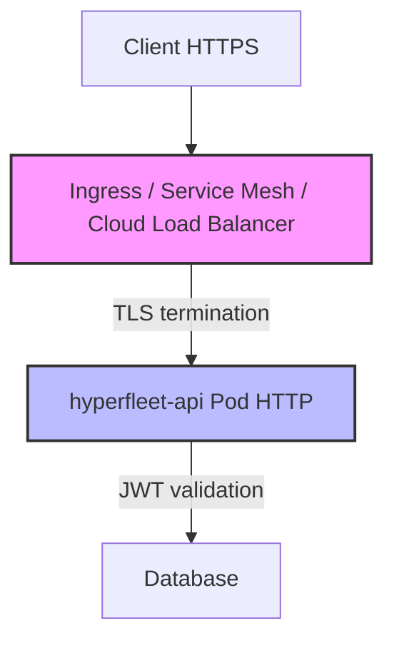
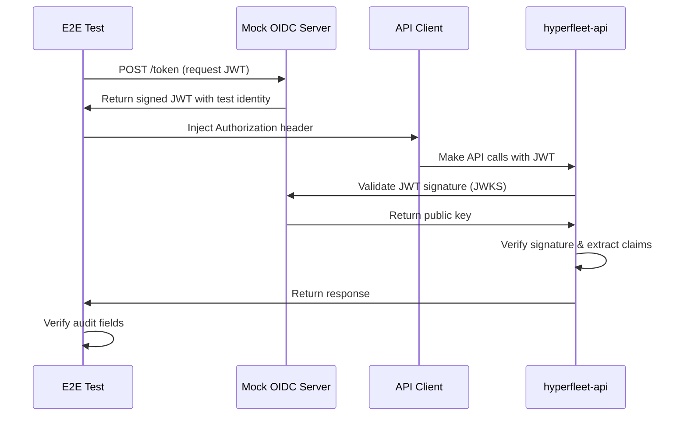

# 0018 — E2E JWT/TLS Architecture

## Context

The E2E test framework ([hyperfleet-e2e](https://gitlab.cee.redhat.com/service/hyperfleet/hyperfleet-e2e)) currently runs without JWT/TLS (development mode), creating a gap between test and production environments. Before implementing security in E2E tests, critical architectural questions were answered to ensure the correct approach and avoid wasted effort.

**Key Decision Point from Office Hours (2026-07-01)**: The team agreed to define a **cloud-agnostic contract** for TLS and JWT handling to avoid relying on specific cloud provider behaviors (GCP, AWS, Azure, OCI).

Production architecture will use infrastructure-level TLS termination:



This means:

- Infrastructure (Ingress/Service Mesh) handles TLS termination
- Application pods receive HTTP traffic (not HTTPS)
- Application validates JWT tokens for authentication

## Decision

**E2E tests will use a cloud-agnostic authentication approach that mirrors the production contract without replicating infrastructure:**

1. **No application-level TLS testing** — Infrastructure handles TLS termination; E2E tests connect via HTTP to the API (matching production pod behavior)
2. **Deploy Mock OIDC server for E2E tests** — Use a lightweight mock OIDC server (e.g., [oauth2-mock-server](https://github.com/navikt/mock-oauth2-server)) in the test cluster instead of cloud-specific identity providers
3. **Test the API contract, not infrastructure** — Validate HTTP + JWT authentication flow, not TLS/certificate handling

### Implementation Details

**Mock OIDC Server Configuration:**

```yaml
config:
  server:
    jwt:
      enabled: true
      issuer_url: "http://mock-oidc-server.hyperfleet-e2e.svc.cluster.local:8080"
      audience: "hyperfleet-e2e-tests"
      identity_claim: "email"
```

**Test Flow:**



**E2E Client Changes** (in [hyperfleet-e2e](https://gitlab.cee.redhat.com/service/hyperfleet/hyperfleet-e2e) repository):

Modify `pkg/client/client.go` to accept optional `Authorization` header and add JWT token generator client:

```go
// Example implementation in hyperfleet-e2e repository (not this architecture repo)
type APIConfig struct {
    URL            string
    JWTEnabled     bool   // Enable JWT authentication
    JWTIssuerURL   string // Mock OIDC server URL
    JWTEmail       string // Email claim for test identity
}
```

**Test Coverage:**

- ✅ API receives HTTP traffic with `Authorization: Bearer <JWT>` header
- ✅ JWT signature validation (via mock OIDC keys)
- ✅ JWT claims extraction (`email` → caller identity)
- ✅ Audit fields populated correctly (`created_by`, `updated_by`, `deleted_by`) — see [v1.0.0 Upgrade Guide §1.4](../docs/release/v0.2.0-to-v1.0.0-upgrade-guide.md#14-jwt-identity-claim-for-audit-fields) for JWT identity claim mapping
- ✅ 401 responses for invalid/missing tokens on **all** requests (GET and mutating) — per v1.0.0, valid JWT required for all operations
- ✅ GETs with valid JWT but missing `identity_claim` proceed without caller identity (no `created_by`/`updated_by` attribution)
- ❌ TLS termination (infrastructure responsibility, out of scope)
- ❌ Certificate validation (infrastructure responsibility, out of scope)

## Consequences

**Gains:**

- ✅ **Cloud-agnostic testing** — E2E tests run identically in GCP, AWS, Azure, on-premises, and local developer machines without cloud-specific authentication
- ✅ **Self-contained CI/CD** — No external dependencies on cloud identity providers; tests run anywhere
- ✅ **Contract testing** — Validates the OIDC/JWT integration contract without cloud lock-in
- ✅ **Test isolation** — Full control over JWT claims, expiration, and failure scenarios for comprehensive testing
- ✅ **Simpler local development** — Developers can run E2E tests locally without cloud credentials
- ✅ **Aligned with production** — Tests mirror production API behavior (HTTP + JWT validation) without replicating infrastructure concerns

**Trade-offs:**

- ⚠️ **Additional test infrastructure** — Must deploy and maintain mock OIDC server in E2E test environments
- ⚠️ **Not testing real cloud identity integration** — Mock OIDC validates the contract but doesn't test actual GCP/AWS/Azure identity provider integration (acceptable because production infrastructure testing is out of scope for E2E tests)
- ⚠️ **No TLS/certificate testing** — E2E tests don't validate TLS termination or certificate handling (acceptable because this is infrastructure responsibility, tested separately)

## Alternatives Considered

| Alternative | Why Rejected |
|-------------|--------------|
| **Use GCP Identity Tokens for E2E tests** | ❌ Violates cloud-agnostic principle — creates hard dependency on GCP. Cannot run tests locally without GCP authentication. Cannot run in AWS or Azure CI/CD environments. Contradicts Office Hours decision: "do not rely on specific cloud provider behaviors". |
| **Implement application-level TLS in hyperfleet-api** | ❌ Production uses infrastructure-level TLS termination (Ingress/Service Mesh). Application pods receive HTTP traffic. Testing app-level TLS would test non-production behavior. |
| **Skip JWT testing entirely in E2E** | ❌ Leaves gap between test and production. Audit field population (`created_by`, `updated_by`, `deleted_by`) wouldn't be validated. Authentication contract wouldn't be tested. |
| **Use separate OIDC mock per cloud provider** | ❌ Unnecessary complexity. OIDC/JWT is a standard protocol; one mock server validates the contract across all environments. |

**Optional GCP Support for Local Development:**

While the decision is to use mock OIDC by default, GCP Identity Token support can be kept as an **optional convenience** for local development:

```bash
# Default: Mock OIDC (cloud-agnostic)
make test-e2e

# Optional: GCP tokens (for developers with GCP access)
export HYPERFLEET_E2E_USE_GCP_JWT=true
gcloud auth login
make test-e2e
```

This preserves developer ergonomics while keeping mock OIDC as the default for CI/CD and cloud-agnostic testing.

---

## References

- **JIRA Tickets**:
  - [HYPERFLEET-1235](https://redhat.atlassian.net/browse/HYPERFLEET-1235) — Investigation
  - [HYPERFLEET-1146](https://redhat.atlassian.net/browse/HYPERFLEET-1146) — Original E2E security gap identification
- **External Resources**:
  - [oauth2-mock-server](https://github.com/navikt/mock-oauth2-server) — Mock OIDC server implementation
  - [RFC 7519 - JWT](https://datatracker.ietf.org/doc/html/rfc7519) — JWT specification
  - [OpenID Connect Core 1.0](https://openid.net/specs/openid-connect-core-1_0.html) — OIDC specification
