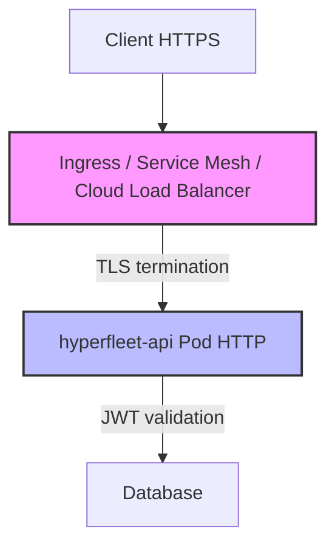
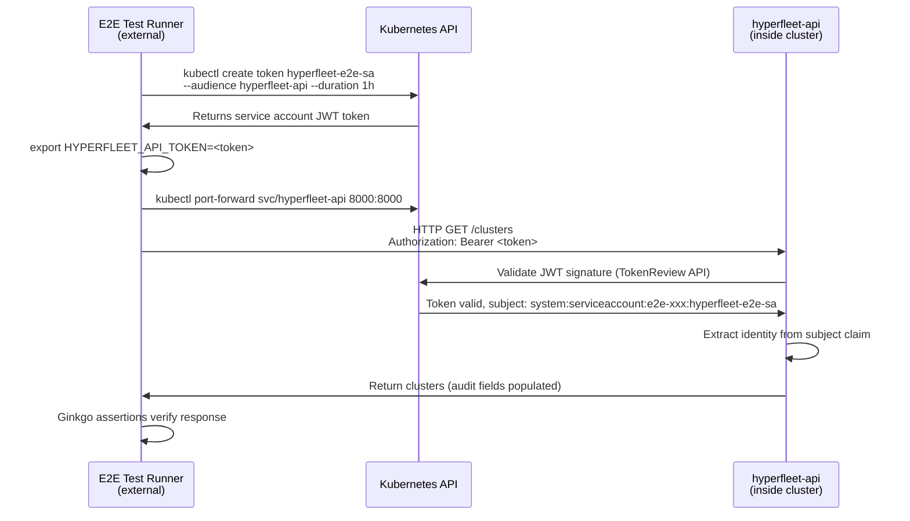

# 0018 — E2E JWT/TLS Architecture

## Context

The E2E test framework ([hyperfleet-e2e](https://gitlab.cee.redhat.com/service/hyperfleet/hyperfleet-e2e)) currently runs without JWT/TLS (development mode), creating a gap between test and production environments. Before implementing security in E2E tests, critical architectural questions were answered to ensure the correct approach and avoid wasted effort.

**Key Decision Point from Office Hours (2026-07-01)**: The team agreed to define a **cloud-agnostic contract** for TLS and JWT handling to avoid relying on specific cloud provider behaviors (GCP, AWS, Azure, OCI).

Production architecture will use infrastructure-level TLS termination:



This means:

- Infrastructure (Ingress/Service Mesh) handles TLS termination
- Application pods receive HTTP traffic (not HTTPS)
- Application validates JWT tokens for authentication

## Decision

**E2E tests will use Kubernetes service account tokens for authentication:**

1. **No application-level TLS testing** — Infrastructure handles TLS termination; E2E tests connect via HTTP to the API (matching production pod behavior)
2. **Use Kubernetes Service Account Tokens for JWT authentication** — Ginkgo tests run **outside the cluster** (developer laptops / CI runners) and use `kubectl create token` to generate service account tokens with `audience: hyperfleet-api`
3. **Test the API contract, not infrastructure** — Validate HTTP + JWT authentication flow, not TLS/certificate handling

### Implementation Details

**Test Execution Model:**

Ginkgo E2E tests run **outside the Kubernetes cluster** (developer laptops / CI runners). Only infrastructure components (API, Sentinel, Adapters) run as pods inside the test namespace.

**Token Generation:**

```bash
# Generate service account token from outside the cluster
export HYPERFLEET_API_TOKEN=$(kubectl create token hyperfleet-e2e-sa \
  --namespace e2e-${RUN_ID} \
  --audience hyperfleet-api \
  --duration 1h)

# Run Ginkgo tests with token
ginkgo run ./test/e2e
```

**Note:** Infrastructure pods (Sentinel/Adapters) use projected service account token volumes as documented in their component designs. E2E tests use `kubectl create token` because they run externally.

**API Configuration** remains unchanged — the API validates service account tokens signed by the Kubernetes cluster:

```yaml
config:
  server:
    jwt:
      enabled: true
      issuer_url: "https://kubernetes.default.svc.cluster.local"
      audience: "hyperfleet-api"
      identity_claim: "sub"  # Service account subject (system:serviceaccount:namespace:name)
```

**Test Flow:**



**E2E Client Changes** (in [hyperfleet-e2e](https://gitlab.cee.redhat.com/service/hyperfleet/hyperfleet-e2e) repository):

Read token from `HYPERFLEET_API_TOKEN` environment variable and inject in `Authorization: Bearer` header for all requests.

**Test Coverage:**

- ✅ API receives HTTP traffic with `Authorization: Bearer <JWT>` header (service account token)
- ✅ JWT signature validation (via Kubernetes TokenReview API)
- ✅ JWT claims extraction (`sub` → caller identity as `system:serviceaccount:namespace:sa-name`)
- ✅ Audit fields populated correctly (`created_by`, `updated_by`, `deleted_by`) using service account subject — see [v1.0.0 Upgrade Guide §1.4](../docs/release/v0.2.0-to-v1.0.0-upgrade-guide.md#14-jwt-identity-claim-for-audit-fields) for JWT identity claim mapping
- ✅ 401 responses for invalid/missing tokens on **all** requests (GET and mutating) — per v1.0.0, valid JWT required for all operations
- ✅ Token expiration behavior (tokens generated with 1h duration via `kubectl create token --duration 1h`)
- ❌ TLS termination (infrastructure responsibility, out of scope)
- ❌ Certificate validation (infrastructure responsibility, out of scope)
- ❌ External user OIDC authentication (E2E tests validate internal service-to-service auth only)

## Consequences

**Gains:**

- ✅ **Kubernetes-native** — Uses built-in TokenRequest API via `kubectl create token`
- ✅ **Real JWT validation** — Tests validate actual Kubernetes-signed tokens, not mocks
- ✅ **Ephemeral tokens** — Generated on-demand with 1h expiration, not stored in cluster
- ✅ **Zero infrastructure** — No pods for token extraction, no mock OIDC server deployment
- ✅ **Cloud-agnostic** — Works in any Kubernetes 1.24+ cluster (GKE, EKS, AKS, kind)
- ✅ **Fast** — Token generation in ~100ms vs ~5-10s for Job-based approaches

**Trade-offs:**

- ⚠️ **Service-to-service auth only** — Tests validate service account authentication, not external user OIDC flows
- ⚠️ **Service account identity format** — Audit fields show `system:serviceaccount:namespace:sa-name` instead of user emails
- ⚠️ **No TLS testing** — Infrastructure-level TLS termination is out of scope for E2E tests
- ⚠️ **Requires kubectl 1.24+** — Kind and modern CI/CD environments already meet this requirement

## Alternatives Considered

| Alternative | Why Rejected |
|-------------|--------------|
| **Job-based token extraction** | ❌ Requires deploying Job pod, waiting ~5-10s, writing to annotation. `kubectl create token` achieves same result in ~100ms with zero resources. |
| **Mock OIDC server** | ❌ Unnecessary infrastructure. Kubernetes provides native JWT authentication via service account tokens. |
| **GCP Identity Tokens** | ❌ Violates cloud-agnostic principle. Cannot run locally or in AWS/Azure CI/CD. |
| **Application-level TLS** | ❌ Production uses infrastructure-level TLS termination. Would test non-production behavior. |
| **Skip JWT testing** | ❌ Leaves gap in authentication contract testing. Audit fields wouldn't be validated. |
| **External OIDC (Keycloak, Dex)** | ❌ Adds operational complexity. Service account tokens are simpler and Kubernetes-native. |

---

## References

- **JIRA Tickets**:
  - [HYPERFLEET-1235](https://redhat.atlassian.net/browse/HYPERFLEET-1235) — Investigation and ADR creation
  - [HYPERFLEET-1342](https://redhat.atlassian.net/browse/HYPERFLEET-1342) — Implementation of `kubectl create token` approach
  - [HYPERFLEET-1146](https://redhat.atlassian.net/browse/HYPERFLEET-1146) — Original E2E security gap identification
- **External Resources**:
  - [kubectl create token documentation](https://kubernetes.io/docs/reference/generated/kubectl/kubectl-commands#-em-token-em-) — Official kubectl command reference
  - [Kubernetes TokenRequest API](https://kubernetes.io/docs/reference/kubernetes-api/authentication-resources/token-request-v1/) — JWT generation and validation mechanism
  - [Kubernetes Service Account Token Projection](https://kubernetes.io/docs/tasks/configure-pod-container/configure-service-account/#serviceaccount-token-volume-projection) — How infrastructure pods (Sentinel/Adapters) mount tokens
  - [RFC 7519 - JWT](https://datatracker.ietf.org/doc/html/rfc7519) — JWT specification
