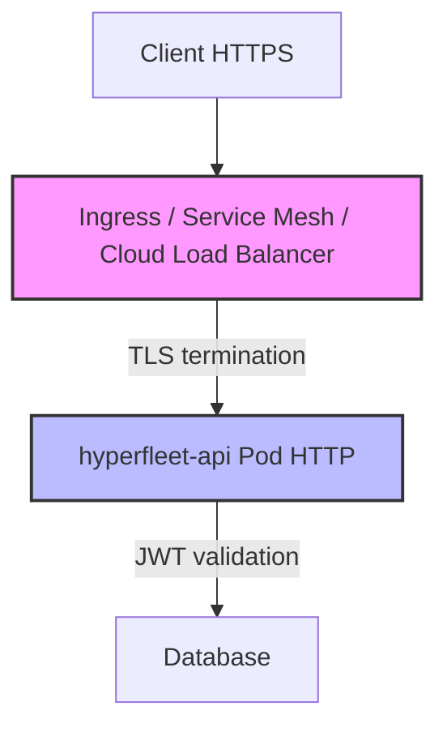
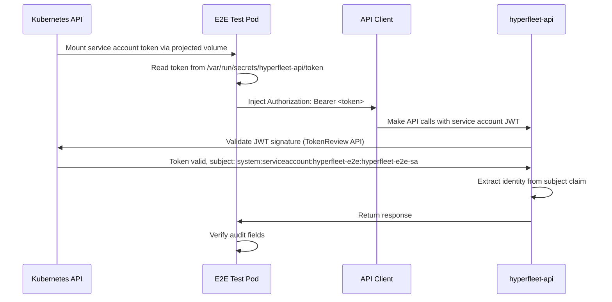

# 0018 — E2E JWT/TLS Architecture

## Context

The E2E test framework ([hyperfleet-e2e](https://gitlab.cee.redhat.com/service/hyperfleet/hyperfleet-e2e)) currently runs without JWT/TLS (development mode), creating a gap between test and production environments. Before implementing security in E2E tests, critical architectural questions were answered to ensure the correct approach and avoid wasted effort.

**Key Decision Point from Office Hours (2026-07-01)**: The team agreed to define a **cloud-agnostic contract** for TLS and JWT handling to avoid relying on specific cloud provider behaviors (GCP, AWS, Azure, OCI).

Production architecture will use infrastructure-level TLS termination:



This means:

- Infrastructure (Ingress/Service Mesh) handles TLS termination
- Application pods receive HTTP traffic (not HTTPS)
- Application validates JWT tokens for authentication

## Decision

**E2E tests will use Kubernetes-native authentication that mirrors how Sentinel and Adapters authenticate to the API:**

1. **No application-level TLS testing** — Infrastructure handles TLS termination; E2E tests connect via HTTP to the API (matching production pod behavior)
2. **Use Kubernetes Service Account Tokens for JWT authentication** — E2E test pods mount projected service account tokens with `audience: hyperfleet-api`, matching the authentication mechanism used by Sentinel and Adapters
3. **Test the API contract, not infrastructure** — Validate HTTP + JWT authentication flow, not TLS/certificate handling

### Implementation Details

**Service Account Token Configuration:**

E2E test pods will mount Kubernetes service account tokens using projected volumes, the same mechanism used by Sentinel and Adapters:

```yaml
# E2E test pod configuration
apiVersion: v1
kind: Pod
metadata:
  name: hyperfleet-e2e-test
  namespace: hyperfleet-e2e
spec:
  serviceAccountName: hyperfleet-e2e-sa
  containers:
    - name: test
      image: hyperfleet-e2e:latest
      volumeMounts:
        - name: api-token
          mountPath: /var/run/secrets/hyperfleet-api
          readOnly: true
      env:
        - name: HYPERFLEET_API_TOKEN_PATH
          value: /var/run/secrets/hyperfleet-api/token
  volumes:
    - name: api-token
      projected:
        sources:
          - serviceAccountToken:
              audience: hyperfleet-api
              expirationSeconds: 3600
              path: token
```

**API Configuration** remains unchanged — the API validates service account tokens signed by the Kubernetes cluster:

```yaml
config:
  server:
    jwt:
      enabled: true
      issuer_url: "https://kubernetes.default.svc.cluster.local"
      audience: "hyperfleet-api"
      identity_claim: "sub"  # Service account subject (system:serviceaccount:namespace:name)
```

**Test Flow:**



**E2E Client Changes** (in [hyperfleet-e2e](https://gitlab.cee.redhat.com/service/hyperfleet/hyperfleet-e2e) repository):

Modify `pkg/client/client.go` to read service account token from mounted volume:

```go
// Example implementation in hyperfleet-e2e repository (not this architecture repo)
type APIConfig struct {
    URL            string
    JWTEnabled     bool   // Enable JWT authentication
    TokenPath      string // Path to service account token file (default: /var/run/secrets/hyperfleet-api/token)
}

// NewClient reads the service account token and injects it in all requests
func NewClient(cfg APIConfig) (*Client, error) {
    var token string
    if cfg.JWTEnabled {
        tokenBytes, err := os.ReadFile(cfg.TokenPath)
        if err != nil {
            return nil, fmt.Errorf("failed to read service account token: %w", err)
        }
        token = string(tokenBytes)
    }
    // ... inject token in Authorization header for all requests
}
```

**Test Coverage:**

- ✅ API receives HTTP traffic with `Authorization: Bearer <JWT>` header (service account token)
- ✅ JWT signature validation (via Kubernetes TokenReview API)
- ✅ JWT claims extraction (`sub` → caller identity as `system:serviceaccount:namespace:sa-name`)
- ✅ Audit fields populated correctly (`created_by`, `updated_by`, `deleted_by`) using service account subject — see [v1.0.0 Upgrade Guide §1.4](../docs/release/v0.2.0-to-v1.0.0-upgrade-guide.md#14-jwt-identity-claim-for-audit-fields) for JWT identity claim mapping
- ✅ 401 responses for invalid/missing tokens on **all** requests (GET and mutating) — per v1.0.0, valid JWT required for all operations
- ✅ Token refresh behavior (tokens auto-rotate every 3600s via projected volume)
- ❌ TLS termination (infrastructure responsibility, out of scope)
- ❌ Certificate validation (infrastructure responsibility, out of scope)
- ❌ External user OIDC authentication (E2E tests validate internal service-to-service auth only)

## Consequences

**Gains:**

- ✅ **Kubernetes-native** — Uses built-in service account token projection; no additional infrastructure to deploy/maintain
- ✅ **Aligned with Sentinel/Adapters** — E2E tests use the exact same authentication mechanism as production components (service account tokens with `audience: hyperfleet-api`)
- ✅ **Real JWT validation** — Tests validate actual Kubernetes-signed tokens, not mocked credentials
- ✅ **Automatic token rotation** — Projected tokens auto-refresh; tests validate token expiration/renewal behavior
- ✅ **Simpler E2E infrastructure** — Eliminates mock OIDC server deployment, configuration, and maintenance
- ✅ **Cloud-agnostic** — Works in any Kubernetes cluster (GKE, EKS, AKS, on-premises, kind for local development)
- ✅ **No new local dependencies** — Leverages existing kind cluster infrastructure already required for E2E tests

**Trade-offs:**

- ⚠️ **Only tests service-to-service authentication** — E2E tests validate internal component authentication (service accounts) but not external user authentication via OIDC providers (acceptable because E2E tests focus on API behavior, not end-user identity flows)
- ⚠️ **Service account identity format** — Audit fields will show `system:serviceaccount:namespace:sa-name` instead of human-readable emails (acceptable for E2E test validation; production user flows tested separately)
- ⚠️ **No TLS/certificate testing** — E2E tests don't validate TLS termination or certificate handling (acceptable because this is infrastructure responsibility, tested separately)

**Note:** Service account tokens work natively in kind clusters, which are already the minimum infrastructure requirement for E2E tests per the [E2E Run Strategy](../docs/e2e-testing/e2e-run-strategy-spike-report.md). No additional local setup is needed beyond the existing kind-based test environment.

## Alternatives Considered

| Alternative | Why Rejected |
|-------------|--------------|
| **Deploy Mock OIDC server (e.g., oauth2-mock-server)** | ⚠️ **Changed to Accepted during review** — Initially proposed but replaced with service account tokens after feedback that Sentinel/Adapters already use this mechanism. Mock OIDC adds unnecessary infrastructure when Kubernetes provides native JWT authentication. Service account tokens align E2E tests with production component authentication. |
| **Use GCP Identity Tokens for E2E tests** | ❌ Violates cloud-agnostic principle — creates hard dependency on GCP. Cannot run tests locally without GCP authentication. Cannot run in AWS or Azure CI/CD environments. Contradicts Office Hours decision: "do not rely on specific cloud provider behaviors". |
| **Implement application-level TLS in hyperfleet-api** | ❌ Production uses infrastructure-level TLS termination (Ingress/Service Mesh). Application pods receive HTTP traffic. Testing app-level TLS would test non-production behavior. |
| **Skip JWT testing entirely in E2E** | ❌ Leaves gap between test and production. Audit field population (`created_by`, `updated_by`, `deleted_by`) wouldn't be validated. Authentication contract wouldn't be tested. |
| **Use external OIDC provider (Keycloak, Dex)** | ❌ Adds operational complexity and external dependencies. Service account tokens are simpler, Kubernetes-native, and already proven in Sentinel/Adapters. |

---

## References

- **JIRA Tickets**:
  - [HYPERFLEET-1235](https://redhat.atlassian.net/browse/HYPERFLEET-1235) — Investigation
  - [HYPERFLEET-1146](https://redhat.atlassian.net/browse/HYPERFLEET-1146) — Original E2E security gap identification
- **External Resources**:
  - [Kubernetes Service Account Token Projection](https://kubernetes.io/docs/tasks/configure-pod-container/configure-service-account/#serviceaccount-token-volume-projection) — Official K8s documentation
  - [RFC 7519 - JWT](https://datatracker.ietf.org/doc/html/rfc7519) — JWT specification
  - [Kubernetes TokenReview API](https://kubernetes.io/docs/reference/kubernetes-api/authentication-resources/token-review-v1/) — JWT validation mechanism
