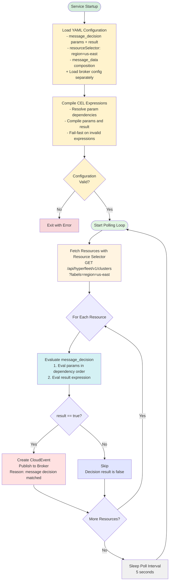
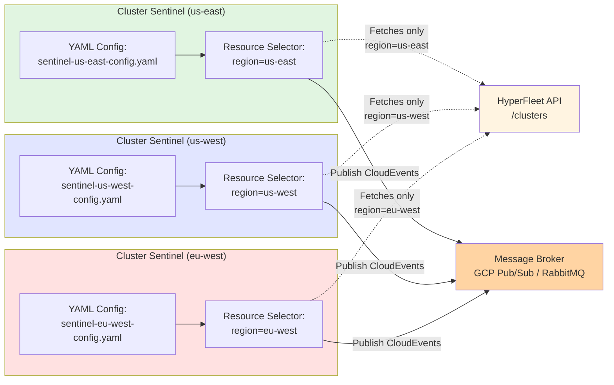

# HyperFleet Sentinel

Design document for the HyperFleet Sentinel service — the central reconciliation loop that continuously polls the HyperFleet API, evaluates configurable CEL-based decision logic, and publishes CloudEvents to the message broker to trigger adapter processing.

For detailed operational documentation, configuration reference, and decision engine test scenarios, see the [Sentinel repository documentation](https://github.com/openshift-hyperfleet/hyperfleet-sentinel/tree/main/docs):

- [Configuration Reference](https://github.com/openshift-hyperfleet/hyperfleet-sentinel/blob/main/docs/config.md)
- [Operator Guide](https://github.com/openshift-hyperfleet/hyperfleet-sentinel/blob/main/docs/sentinel-operator-guide.md)
- [Decision Engine Reference](https://github.com/openshift-hyperfleet/hyperfleet-sentinel/blob/main/docs/decision-engine.md) — CEL function reference, status tracking, adapter contract, test scenarios
- [Multi-Instance Deployment](https://github.com/openshift-hyperfleet/hyperfleet-sentinel/blob/main/docs/multi-instance-deployment.md)

---

## Table of Contents

- [What & Why](#what--why)
- [Sentinel Architecture](#sentinel-architecture)
  - [The Problem: Stuck Workflows](#the-problem-stuck-workflows)
  - [The Solution: Continuous Reconciliation with Direct Broker Publishing](#the-solution-continuous-reconciliation-with-direct-broker-publishing)
  - [Decision Logic](#decision-logic)
  - [Resource Filtering](#resource-filtering)
- [Trade-offs](#trade-offs)
  - [What We Gain](#what-we-gain)
  - [What We Lose / What Gets Harder](#what-we-lose--what-gets-harder)
  - [Technical Debt Incurred](#technical-debt-incurred)
  - [Acceptable Because](#acceptable-because)
- [Alternatives Considered](#alternatives-considered)
  - [Outbox Pattern (v1 Architecture)](#outbox-pattern-v1-architecture)
  - [Push-Based Triggering (Webhooks / API Watch)](#push-based-triggering-webhooks--api-watch)
  - [Hardcoded Decision Logic](#hardcoded-decision-logic)
  - [Kubernetes Controller Pattern](#kubernetes-controller-pattern)
- [Post-MVP Enhancements](#post-mvp-enhancements)

---

## What & Why

### What

Implement a "HyperFleet Sentinel" service that continuously polls the HyperFleet API for resources (clusters, node pools, etc.) and publishes reconciliation events directly to the message broker to trigger adapter processing. The Sentinel acts as the "watchful guardian" of the HyperFleet system with configurable message decision logic using CEL expressions and composable boolean params. Multiple Sentinel deployments can be configured via YAML configuration files to handle different shards of resources for horizontal scalability.

**Pattern Reusability**: The Sentinel is designed as a generic reconciliation service that can watch ANY HyperFleet resource type, not just clusters. Future deployments can include:

- **Cluster Sentinel** (this epic) - watches clusters
- **NodePool Sentinel** (future) - watches node pools
- **[Resource] Sentinel** (future) - watches any HyperFleet resource

### Why

Without the Sentinel, the cluster provisioning workflow has a critical gap:

1. **No Reconciliation Loop**: After adapters complete their work and put status updates, nothing triggers subsequent adapters to check if they can now proceed
2. **Stuck Clusters**: Clusters remain in "pending" state indefinitely with no mechanism to retry failed operations
3. **Manual Intervention Required**: Operators must manually trigger reconciliation or restart adapters
4. **No Failure Recovery**: Transient failures cannot self-heal without a retry mechanism

The Sentinel solves these problems by:

- **Closing the reconciliation loop**: Continuously polls resources and publishes events to trigger adapter evaluation
- **Uses adapter status updates**: Reads `status.conditions[].last_updated_time` and condition statuses (updated by adapters on every check) to determine when to create next event
- **Fully configurable decision logic**: Named CEL params and a boolean result expression define the complete decision logic (e.g., different age thresholds for ready vs not-ready resources)
- **Relies on API-computed Reconciled condition**: The API aggregates adapter statuses into a `Reconciled` condition — when `Reconciled != True` (including after spec changes that increment `generation`), the Sentinel's default rules trigger reconciliation
- **Self-healing**: Automatically retries without manual intervention
- **Horizontal scalability**: Resource filtering allows multiple Sentinels to handle different resource subsets
- **Event-driven architecture**: Maintains decoupling by publishing CloudEvents to message broker
- **Reusable pattern**: Same service can watch clusters, node pools, or any future HyperFleet resource
- **Direct publishing**: Publishes events directly to broker, simplifying architecture (no outbox pattern needed)

---

## Sentinel Architecture

### The Problem: Stuck Workflows

**Without Sentinel**:

```text
User creates cluster
  → Validation adapter processes
  → Validation reports status
  → STUCK - Nothing triggers next check

Adapter fails transiently
  → STUCK - No retry mechanism
```

### The Solution: Continuous Reconciliation with Direct Broker Publishing

**Reconciliation Loop (Per Resource Selector)**:



**Multiple Sentinel Deployments (Resource Filtering)**:



### Decision Logic

The service uses a fully configurable decision logic based on the `message_decision` configuration. There is no hardcoded check — all decision logic is expressed as CEL rules:

**Publish Event IF:**

- Evaluate all `message_decision.params` in dependency order (each param is a CEL expression)
- Params can reference other params (e.g., `is_reconciled` can be used in `reconciled_and_stale`)
- Evaluate `message_decision.result` boolean expression (standard CEL logical operators)
- If result is `true` → publish event

**Skip IF:**

- Message decision result is `false`

**Key Insight — Why No Hardcoded Generation Check:**

The API already aggregates adapter statuses into the `Reconciled` condition. When a user changes the resource spec (incrementing `generation`), the API sets `Reconciled` to `False` because not all adapters have reconciled the new generation yet. This means `Reconciled == False` already covers the generation mismatch case — there is no need for the Sentinel to duplicate this logic with a separate generation check.

This simplifies the Sentinel to a single unified rule engine:

- The `Reconciled` condition is the canonical signal for "this resource needs reconciliation"
- The `LastKnownReconciled` condition is informational but not used for decision-making in the default configuration
- Operators can write custom rules using any condition type if their use case requires it

For the complete message decision reference, CEL function documentation, and test scenarios, see [Decision Engine Reference](https://github.com/openshift-hyperfleet/hyperfleet-sentinel/blob/main/docs/decision-engine.md) in the sentinel repository.

### Resource Filtering

Resource filtering enables horizontal scaling by allowing operators to distribute resources across multiple Sentinel instances using label-based selectors. The `resource_selector` uses a list of label/value pairs with AND logic (all labels must match).

<!-- markdownlint-disable-next-line MD036 -->
**Important: This is NOT True Sharding**

- True sharding guarantees complete coverage: all resources are handled by exactly one shard
- Sentinel uses `resource_selector` which is just label-based filtering
- No coordination between Sentinel instances
- Possible to have gaps (resources not selected by any Sentinel) or overlaps (resources selected by multiple Sentinels)
- Operators must ensure their resource selectors provide desired coverage
- See also: [Sharding Coverage Design](../../docs/sharding-coverage-design.md)

For deployment patterns, configuration examples, and resource filtering strategies, see [Multi-Instance Deployment](https://github.com/openshift-hyperfleet/hyperfleet-sentinel/blob/main/docs/multi-instance-deployment.md) in the sentinel repository.

---

## Trade-offs

### What We Gain

- ✅ **Decoupled reconciliation**: Sentinel has no knowledge of which adapters exist; adapters have no knowledge of each other. New adapters can be added with zero changes to Sentinel.
- ✅ **Self-healing**: Transient failures are automatically retried on the next poll cycle without manual intervention.
- ✅ **Configurable decision logic**: CEL expressions allow different reconciliation thresholds and conditions per deployment (e.g., different debounce periods for prod vs. dev, or different logic per resource type) without code changes.
- ✅ **Horizontal scalability**: Multiple Sentinel instances with label-based resource selectors distribute load without inter-instance coordination.
- ✅ **Generic pattern**: The same service handles clusters, nodepools, or any future HyperFleet resource type — only the configuration changes.
- ✅ **Low implementation complexity**: A polling loop against a REST API is simpler to implement, test, and operate than a watch/push mechanism for MVP.

### What We Lose / What Gets Harder

- ❌ **Polling overhead**: Sentinel fetches all matching resources on every poll cycle (default 5s), even when most resources are stable. This creates constant API load proportional to resource count, not to activity level.
- ❌ **No guaranteed exactly-once delivery**: If Sentinel publishes to the broker and then crashes, the event may be re-published on the next cycle. Mitigated by requiring all adapters to be idempotent.
- ⚠️ **Gap/overlap risk with label-based sharding**: Resource selectors are label filters, not true shards. Operators must manually ensure full resource coverage — there is no automated verification that all resources are watched by at least one Sentinel instance. See [Sharding Coverage Design](../../docs/sharding-coverage-design.md).
- ⚠️ **Minimum reconciliation latency equals poll interval**: A resource spec change is not reconciled until the next poll cycle (up to 5s). This is acceptable for cluster provisioning use cases but unsuitable for latency-sensitive workflows.
- ⚠️ **Broker dependency**: If the message broker is unavailable, Sentinel cannot trigger reconciliation events. Adapters are not notified; the cluster remains in its current state until the broker recovers.

### Technical Debt Incurred

- **Single-instance MVP**: The initial deployment uses a single Sentinel watching all resources (`resource_selector: []`). Multi-Sentinel sharding requires manual operator coordination with no automated coverage verification.
  - **Impact**: Low at MVP cluster counts; becomes a reliability risk as the number of managed clusters grows.
  - **Remediation**: Post-MVP, surface stuck resources via an API-side stale-resource metric that catches sharding gaps (among other causes). See [Sharding Coverage Design](../../docs/sharding-coverage-design.md).

- **Polling instead of watching**: Sentinel polls the API on a fixed interval rather than reacting to resource change events via a push mechanism. This wastes compute on stable resources and introduces latency proportional to the poll interval.
  - **Impact**: Constant background API load; up to 5s reaction time to spec changes.
  - **Remediation**: Post-MVP, consider an API watch endpoint or webhook-triggered publishing to reduce idle load.

### Acceptable Because

- MVP targets a small number of clusters where polling overhead is negligible.
- Adapters are designed to be idempotent, making duplicate events safe.
- CEL-based decision logic with debouncing controls event flood risk.
- Decoupling and self-healing are higher-priority reliability properties for MVP than polling efficiency.

---

## Alternatives Considered

### Outbox Pattern (v1 Architecture)

**What**: The API writes reconciliation events to an "outbox" database table; a separate Outbox Reconciler polls the table and publishes events to the broker.

**Why Rejected**: Introduces an extra service component (Outbox Reconciler), increases end-to-end latency (two polling hops: API poll + outbox poll), and adds operational complexity. The v2 direct Sentinel publishing approach removes the outbox entirely, reduces component count from 6 to 5, and simplifies the architecture. Adapters are idempotent, so the loss of strict transactional event delivery is an acceptable trade-off for MVP.

See: [Glossary: Outbox Pattern](../../docs/glossary.md)

### Push-Based Triggering (Webhooks / API Watch)

**What**: Instead of Sentinel polling the API, the API pushes notifications to Sentinel when resources change — via webhooks or a watch API similar to Kubernetes informers.

**Why Rejected**: Requires the API to know about Sentinel (coupling in the wrong direction), and adds webhook delivery reliability complexity (retry queues, failure handling). Polling is simpler to implement and operate at MVP scale. This remains a viable post-MVP enhancement to reduce idle API load.

### Hardcoded Decision Logic

**What**: Encode fixed reconciliation logic (e.g., "always publish if not ready for more than 10s") directly in Go code, removing the CEL configuration layer.

**Why Rejected**: Different resource types (clusters vs. nodepools), environments (production vs. dev), and tenants need different reconciliation thresholds and conditions. CEL expressions allow operators to tune behavior without redeploying Sentinel. The configurability cost (CEL expression management, topological sort, compile-time validation) is justified by the flexibility gained.

### Kubernetes Controller Pattern

**What**: Implement Sentinel as a Kubernetes controller using `controller-runtime`, watching Kubernetes CRDs rather than polling the HyperFleet REST API.

**Why Rejected**: HyperFleet resources live in the HyperFleet REST API, not as Kubernetes CRDs. Adopting `controller-runtime` would require converting all HyperFleet resources to CRDs — a significant API design change outside current scope. A simple polling loop against the REST API is sufficient for MVP and avoids introducing a Kubernetes API server dependency.

---

## Post-MVP Enhancements

### Advanced Alerting

- **Dead Man's Switch**: Alerting when no messages are received within a configured time period.
- **Queue Lag Monitoring**: Alerting when messages in the queue are not being consumed or backlog is increasing.
