# HyperFleet Pull Secret Service - Design Decision Record

---

## Table of Contents

1. [System Overview](#1-system-overview)
2. [Architecture Components](#2-architecture-components)
3. [API Design](#3-api-design)
4. [Deployment Architecture](#4-deployment-architecture)
5. [Database Schema](#5-database-schema)
6. [Security Architecture](#6-security-architecture)
7. [Scalability and Performance](#7-scalability-and-performance)
8. [Rollout Plan](#8-rollout-plan)

---

## 1. System Overview

### 1.1 Purpose

The **HyperFleet Pull Secret Service** is a cloud-agnostic credential management microservice that generates, stores, rotates, and manages container registry pull secrets for HyperFleet-managed Kubernetes clusters.

### 1.2 System Context Diagram


> **Note**: The dotted line to Private/Customer Registries highlights a new capability in this design **Principle 5 (Extensible Registry Support),** enabling integration with any container registry via the `RegistryClient` interface (e.g., Harbor, Nexus, ACR, ECR, GCR, or custom implementations).

### 1.3 Design Principles


### 1.4 How Design Principles Map to Architecture

Design principles are not abstract concepts—they translate into concrete architectural decisions, code patterns, and operational practices. This section traces each principle through the system architecture, showing **why** specific choices were made and **what trade-offs** were accepted.

#### Overview: Principle Impact Matrix

This matrix shows which sections of the architecture are most influenced by each design principle:

| Section | P1: Lift & Shift | P2: Cloud Agnostic | P3: Flexible Deployment | P4: Security First | P5: Extensible Registries | P6: Dedicated Partner | P7: T-Rex Pattern |
|---------|:----------------:|:------------------:|:-----------------------:|:------------------:|:------------------------:|:--------------------:|:-----------------:|
| [Components](#2-architecture-components) | 🔵 High | 🟢 High | - | 🔴 Medium | 🟠 High | 🟤 High | ⚫ High |
| [API Design](#3-api-design) | 🔵 High | 🟢 High | - | 🔴 Medium | - | - | ⚫ High |
| [Deployment](#4-deployment-architecture) | - | 🟢 High | 🟡 High | 🔴 Medium | - | 🟤 High | ⚫ Medium |
| [Database](#5-database-schema) | 🔵 High | - | 🟡 Medium | 🔴 High | 🟠 Low | - | - |
| [Security](#6-security-architecture) | 🔵 Medium | - | - | 🔴 High | 🟠 Low | 🟤 High | ⚫ Low |
| [Performance](#7-scalability-and-performance) | 🔵 Medium | 🟢 Low | 🟡 Medium | - | - | - | - |

**Legend**: 🔵 Lift & Shift | 🟢 Cloud Agnostic | 🟡 Flexible Deployment | 🔴 Security First | 🟠 Extensible Registries | 🟤 Dedicated Partner | ⚫ T-Rex Pattern

---

#### Principle 1: Lift and Shift from AMS

**Core Idea**: Reuse proven, battle-tested patterns from AMS instead of reinventing credential management.


**Concrete Examples:**

<details>
<summary><b>Example 1: Advisory Lock Pattern (Section2 Components)</b></summary>

**AMS Pattern:**
```go
// uhc-account-manager/pkg/dao/registry_credential.go
func (d *DAO) AcquireAdvisoryLock(ctx context.Context, clusterID string) {
    hash := HashClusterID(clusterID)
    d.db.Exec("SELECT pg_advisory_lock(?)", hash)
}
```

**HyperFleet Adoption (identical):**
```go
// hyperfleet/pull-secret-service/pkg/dao/registry_credential.go
func (d *DAO) AcquireAdvisoryLock(ctx context.Context, clusterID string) {
    hash := HashClusterID(clusterID)
    d.db.Exec("SELECT pg_advisory_lock(?)", hash)
}
```

**Why**: Prevents race conditions when multiple requests try to create credentials for same cluster simultaneously. Proven in production under high concurrency.

**Trade-off**: PostgreSQL-specific (not portable to NoSQL), but acceptable given PostgreSQL requirement.

</details>

<details>
<summary><b>Example 2: Database Schema Reuse (Section5 Database)</b></summary>

**AMS Schema:**
```sql
-- uhc-account-manager/pkg/db/migrations/20210415_registry_credentials.sql
CREATE TABLE registry_credentials (
    id UUID PRIMARY KEY,
    username VARCHAR(255) NOT NULL,
    token TEXT NOT NULL,  -- Encrypted with pgcrypto
    account_id UUID,      -- Nullable for pool credentials
    registry_id VARCHAR(50) NOT NULL,
    created_at TIMESTAMPTZ NOT NULL DEFAULT NOW()
);
```

**HyperFleet Adoption (semantic mapping):**
```sql
-- hyperfleet/pull-secret-service/pkg/db/migrations/001_registry_credentials.sql
CREATE TABLE registry_credentials (
    id UUID PRIMARY KEY,
    username VARCHAR(255) NOT NULL,
    token TEXT NOT NULL,  -- Encrypted with pgcrypto (SAME)
    cluster_id UUID,      -- Renamed: account_id → cluster_id
    registry_id VARCHAR(50) NOT NULL,
    created_at TIMESTAMPTZ NOT NULL DEFAULT NOW()
);
```

**Why**: Field name `account_id` kept in code for compatibility, but semantically stores `cluster_id`. Minimizes code changes during lift-and-shift.

**Benefit**: 6 months of development time saved by not redesigning schema.

</details>

**Trade-offs Accepted:**
- ✅ **Faster time-to-market**: 70% code reuse → 6 months dev time saved
- ✅ **Lower risk**: AMS patterns proven at scale (10K+ clusters)
- ⚠️ **Technical debt**: Some AMS-specific naming (e.g., `AccountID` column) retained

---

#### Principle 2: Cloud Agnostic

**Core Idea**: Single codebase supports GCP, AWS, Azure, on-prem without conditional logic.


**Concrete Examples:**

<details>
<summary><b>Example 1: Registry Interface Abstraction (Section2 Components)</b></summary>

**Interface (Cloud-Agnostic):**
```go
// pkg/client/registry/interface.go
type RegistryClient interface {
    CreateCredential(ctx context.Context, name string) (*Credential, error)
    DeleteCredential(ctx context.Context, name string) error
}
```

**Quay Implementation:**
```go
// pkg/client/quay/client.go
func (c *QuayClient) CreateCredential(ctx context.Context, name string) (*Credential, error) {
    // Quay-specific: Bearer token auth, robot account creation
    resp := c.httpClient.Post("/api/v1/organization/{org}/robots/{name}", ...)
    return &Credential{Username: resp.Name, Token: resp.Token}, nil
}
```

**RHIT Implementation:**
```go
// pkg/client/rhit/client.go
func (c *RHITClient) CreateCredential(ctx context.Context, name string) (*Credential, error) {
    // RHIT-specific: mTLS auth, partner service account, JWT token
    resp := c.httpClient.Post("/v1/partners/ocm-service/service-accounts", ...)
    return &Credential{Username: "|" + resp.Name, Token: resp.JWT}, nil
}
```

**Service Layer (No Cloud Logic):**
```go
// pkg/services/access_token.go
func (s *AccessTokenService) GeneratePullSecret(ctx context.Context, clusterID string) {
    for _, registry := range registries.All() {
        var client RegistryClient
        switch registry.Type {
        case QuayRegistry:
            client = s.quayClient  // Polymorphic
        case RedhatRegistry:
            client = s.rhitClient  // Polymorphic
        }

        cred, _ := client.CreateCredential(ctx, generateName(clusterID))
        // No cloud-specific logic here
    }
}
```

**Why**: Adding a new registry (e.g., Harbor, Nexus) requires only implementing `RegistryClient` interface—no changes to service layer.

</details>

<details>
<summary><b>Example 2: Adapter Pattern for Cloud Storage (Section4 Deployment)</b></summary>

**Before (Anti-pattern):**
```go
// ❌ BAD: Cloud-specific logic in service
func (s *Service) StorePullSecret(pullSecret string, clusterID string) {
    if os.Getenv("CLOUD") == "gcp" {
        s.gcpSecretManager.CreateSecret(...)
    } else if os.Getenv("CLOUD") == "aws" {
        s.awsSecretsManager.CreateSecret(...)
    }
}
```

**After (Adapter Pattern):**
```go
// ✅ GOOD: Service only returns pull secret
func (s *Service) GeneratePullSecret(clusterID string) string {
    credentials := s.createCredentials(clusterID)
    pullSecret := s.formatDockerAuth(credentials)
    return pullSecret  // Adapter decides where to store
}

// GCP Adapter (outside service)
func (a *GCPAdapter) OnPullSecretGenerated(pullSecret string) {
    a.gcpSecretManager.CreateSecret(...)
}

// AWS Adapter (outside service)
func (a *AWSAdapter) OnPullSecretGenerated(pullSecret string) {
    a.awsSecretsManager.CreateSecret(...)
}
```

**Why**: Pull Secret Service has zero cloud dependencies. Same Docker image runs on all clouds.

</details>

**Trade-offs Accepted:**
- ✅ **Single codebase**: One Docker image for GCP, AWS, Azure
- ✅ **Faster feature parity**: New feature available on all clouds simultaneously
- ⚠️ **Lowest common denominator**: Can't use cloud-specific features (e.g., GCP Workload Identity Federation)

---

#### Principle 3: Flexible Deployment

**Core Idea**: Support two deployment models to match different operational contexts—multi-region managed service OR single datacenter self-managed.


**Architecture Support**: The service design accommodates **both** deployment models through:
- Cloud-agnostic core (Principle 2)
- Configurable database connection (per-region or global)
- Optional global load balancer integration
- Shared Quay/RHIT API clients

**Concrete Examples:**

<details>
<summary><b>Example 1: Per-Instance Deployment (HyperFleet SaaS)</b></summary>

**Use Case**: Multi-region managed service across GCP, AWS, Azure

**Deployment:**
```yaml
# us-east-1 instance
apiVersion: apps/v1
kind: Deployment
metadata:
  name: pull-secret-service
  namespace: hyperfleet-system
spec:
  template:
    spec:
      containers:
        - name: api
          env:
            - name: DATABASE_URL
              value: "postgresql://pull-secret-us-east-1.db.gcp:5432/hyperfleet"
              # ↑ REGION-SPECIFIC DATABASE (isolated)

# eu-west-1 instance (completely independent)
apiVersion: apps/v1
kind: Deployment
metadata:
  name: pull-secret-service
  namespace: hyperfleet-system
spec:
  template:
    spec:
      containers:
        - name: api
          env:
            - name: DATABASE_URL
              value: "postgresql://pull-secret-eu-west-1.db.gcp:5432/hyperfleet"
              # ↑ DIFFERENT DATABASE (failure isolated)
```

**Benefits**:
- ✅ us-east-1 outage does NOT affect eu-west-1
- ✅ In-cluster networking only (simple)
- ✅ Data stays in region (GDPR compliant)

**Cost**: $680/month (3 regions)

</details>

<details>
<summary><b>Example 2: Global Shared Deployment (OCP Self-Managed)</b></summary>

**Use Case**: Single datacenter OCP deployment, centralized operations

**Deployment:**
```yaml
# Global service with multi-region replicas
apiVersion: apps/v1
kind: Deployment
metadata:
  name: pull-secret-service-global
  namespace: hyperfleet-system
spec:
  replicas: 5  # Spread across availability zones
  template:
    spec:
      containers:
        - name: api
          env:
            - name: DATABASE_URL
              value: "postgresql://pull-secret-global.db:5432/hyperfleet"
              # ↑ SINGLE GLOBAL DATABASE (shared across all clusters)
            - name: DEPLOYMENT_MODE
              value: "global"  # Enables global load balancer mode
```

**Global Load Balancer:**
```yaml
apiVersion: v1
kind: Service
metadata:
  name: pull-secret-service-global
  annotations:
    cloud.google.com/load-balancer-type: "External"  # Global LB
spec:
  type: LoadBalancer
  ports:
    - port: 443
      targetPort: 8080
```

**Benefits**:
- ✅ Single deployment to manage
- ✅ Shared credential pool (cost efficient)
- ✅ Centralized audit trail

**Cost**: $490/month (~28% cheaper)

</details>

**Decision Criteria**:

| Question | If YES → | If NO → |
|----------|----------|---------|
| Do you have multiple geographic regions? | **Option A** | **Option B** |
| Is failure isolation more important than cost? | **Option A** | **Option B** |
| Do you have data residency requirements (GDPR, etc.)? | **Option A** | **Option B** |
| Is this a single datacenter deployment? | **Option B** | **Option A** |
| Is centralized operations a priority? | **Option B** | **Option A** |

**Trade-offs**:

| Aspect | Option A (Per-Instance) | Option B (Global Shared) |
|--------|------------------------|--------------------------|
| **Cost** | ⚠️ Higher ($680/month) | ✅ Lower ($490/month) |
| **Failure Isolation** | ✅ Regional blast radius | ⚠️ Global blast radius |
| **Operational Complexity** | ⚠️ Manage N instances | ✅ Single instance |
| **Latency** | ✅ <10ms in-cluster | ⚠️ 50-200ms cross-region |
| **Data Residency** | ✅ Compliant by design | ⚠️ Requires special handling |

---

#### Principle 4: Security First

**Core Idea**: Defense in depth—multiple security layers protect credentials and audit all operations.


**The 5 Security Layers Explained:**

Security is not an afterthought—it's the foundation of the architecture. Every API request must traverse **5 defensive layers** before accessing credentials:

**Layer 1: Authentication** - *Who are you?*
- **Purpose**: Validate the identity of the API caller
- **Implementation**: Kubernetes ServiceAccount tokens validated using TokenReview API
- **Example**: GCP Adapter presents a valid ServiceAccount token before making any operation
- **Protection**: Invalid tokens are rejected immediately (401 Unauthorized)

**Layer 2: Authorization** - *What can you do?*
- **Purpose**: Verify the authenticated user has permission for the requested operation
- **Implementation**: Kubernetes RBAC (Role-Based Access Control) policies
- **Example**: GCP Adapter can create credentials, but a read-only user cannot
- **Protection**: Even with valid authentication, unauthorized operations are blocked (403 Forbidden)

**Layer 3: Encryption at Rest** - *Data protected in storage*
- **Purpose**: Encrypt tokens/passwords before saving to database
- **Implementation**: PostgreSQL `pgcrypto` extension with AES-256-GCM encryption
- **Example**:
  - Original token: `eyJhbGciOiJIUzI1NiIsInR5cCI6IkpXVCJ9...`
  - Stored in DB: `\xc30d04070302f8a3e1b2c4d5e6f7...` (encrypted blob)
- **Protection**: Database backups are useless without the encryption key (stored separately in Kubernetes Secret, rotated every 90 days)
- **Compliance**: Required by SOC 2, ISO 27001, GDPR for credential storage

**Layer 4: Encryption in Transit** - *Data protected during transmission*
- **Purpose**: Encrypt data while traveling over the network
- **Implementation**:
  - TLS for in-cluster communication (Adapter → Service)
  - mTLS with client certificates for external APIs (Service → Quay/RHIT)
- **Example**: All communication to Quay.io uses mTLS with HyperFleet-dedicated certificates
- **Protection**: Prevents man-in-the-middle attacks and network eavesdropping

**Layer 5: Audit Logging** - *Who did what, when, and why?*
- **Purpose**: Create immutable audit trail for every credential operation
- **Implementation**: Dedicated `credential_audit_log` table records all actions
- **Example**: Every create/rotate/delete operation logs:
  - **WHO** (actor): `system:serviceaccount:hyperfleet-system:gcp-adapter`
  - **WHAT** (action): `create`, `rotate`, `delete`
  - **WHEN** (timestamp): `2025-10-01 10:00:00Z`
  - **WHY** (reason): `cluster_provisioning`, `scheduled_rotation`
  - **WHICH** (credential_id): `cred-abc-123`
- **Protection**: Full traceability for security investigations and compliance audits
- **Compliance**: Required by SOC 2, ISO 27001 for audit trail requirements

**Defense in Depth Philosophy:**

The layered approach ensures that **even if one layer is compromised, the others protect the system**:

- If Layer 1 fails (token stolen): Layer 2 blocks unauthorized actions
- If Layer 2 fails (RBAC misconfigured): Layer 5 logs the suspicious activity
- If Layer 3 fails (database leaked): Tokens are encrypted and useless without the key
- If Layer 4 fails (network compromised): Tokens in the database remain encrypted

**Real-World Breach Scenario:**

Attacker steals PostgreSQL database backup:
1. ❌ Tokens are encrypted → Attacker sees `\xc30d04...` (useless blob)
2. ❌ Encryption key is in Kubernetes Secret → Not in the backup
3. ❌ Key rotates every 90 days → Old backups become worthless
4. ✅ **Result**: Credentials remain secure despite database breach

**Concrete Examples:**

<details>
<summary><b>Example 1: Token Encryption at Rest (Section6 Security)</b></summary>

**Database encryption with pgcrypto:**
```go
// INSERT: Encrypt token before storing
func (d *DAO) InsertCredential(cred *Credential) error {
    encryptionKey := os.Getenv("DB_ENCRYPTION_KEY")  // From K8s Secret

    query := `
        INSERT INTO registry_credentials (id, username, token, cluster_id, registry_id)
        VALUES ($1, $2, pgp_sym_encrypt($3, $4), $5, $6)
    `
    //                    ↑ Encrypt with AES-256-GCM

    return d.db.Exec(query, cred.ID, cred.Username, cred.Token, encryptionKey, cred.ClusterID, cred.RegistryID).Error
}

// SELECT: Decrypt token when reading
func (d *DAO) GetCredential(credID string) (*Credential, error) {
    encryptionKey := os.Getenv("DB_ENCRYPTION_KEY")

    query := `
        SELECT id, username,
               pgp_sym_decrypt(token::bytea, $2) AS token,
               cluster_id, registry_id
        FROM registry_credentials WHERE id = $1
    `
    //     ↑ Decrypt on read

    var cred Credential
    d.db.Raw(query, credID, encryptionKey).Scan(&cred)
    return &cred, nil
}
```

**Database raw storage (encrypted):**
```
hyperfleet=# SELECT username, token FROM registry_credentials LIMIT 1;
username                                        | token
----------------------------------------------- | -------------------------------------------------------
redhat-openshift+hyperfleet_gcp_useast1_abc123 | \xc30d04070302f8a3e1b2c4d5e6f7...  ← Encrypted blob
```

**Why**: If database backup is stolen, tokens are useless without encryption key (stored separately in K8s Secret, rotated every 90 days).

**Compliance**: SOC 2, ISO 27001, GDPR require encryption at rest for credentials.

</details>

<details>
<summary><b>Example 2: Audit Logging (Section6 Security)</b></summary>

**Audit log on every credential operation:**
```go
func (s *RegistryCredentialService) Create(ctx context.Context, cred *Credential) error {
    // 1. Create credential
    err := s.dao.InsertCredential(cred)
    if err != nil {
        return err
    }

    // 2. Log audit event (ALWAYS, even on failure)
    auditLog := &AuditLog{
        ClusterID:     cred.ClusterID,
        CredentialID:  cred.ID,
        Action:        "create",
        Actor:         GetActorFromContext(ctx),  // "system:serviceaccount:hyperfleet-system:gcp-adapter"
        Reason:        "cluster_provisioning",
        TraceID:       GetTraceIDFromContext(ctx),
        Metadata: map[string]interface{}{
            "registry_id": cred.RegistryID,
            "username":    cred.Username,
        },
    }
    s.auditDAO.Insert(auditLog)

    return nil
}
```

**Audit log query example:**
```sql
-- Who created credentials for cluster cls-abc-123?
SELECT action, actor, reason, created_at
FROM credential_audit_log
WHERE cluster_id = 'cls-abc-123'
ORDER BY created_at DESC;

-- Result:
-- action  | actor                                    | reason                | created_at
-- ------- | ---------------------------------------- | --------------------- | -------------------
-- create  | system:serviceaccount:...:gcp-adapter    | cluster_provisioning  | 2025-10-01 10:00:00
-- rotate  | system:serviceaccount:...:gcp-adapter    | scheduled_rotation    | 2025-12-30 14:30:00
-- delete  | user:john.doe@redhat.com                 | cluster_deprovisioning| 2026-01-15 09:00:00
```

**Why**: Audit trail required for compliance (SOC 2, ISO 27001). Can trace every credential operation to specific actor and timestamp.

</details>

**Trade-offs Accepted:**
- ✅ **Defense in depth**: Multiple layers of security (not relying on single control)
- ✅ **Compliance ready**: Meets SOC 2, ISO 27001, GDPR requirements
- ⚠️ **Performance overhead**: Encryption/decryption adds ~10-20ms latency per query
- ⚠️ **Storage overhead**: Audit logs grow over time (mitigated by retention policy)

---

#### Principle 5: Extensible Registry Support

**Core Idea**: Support any container registry (public or private) through interface-based design, preventing vendor lock-in and enabling customer-specific requirements.

```mermaid
graph TB
    subgraph Service["Pull Secret Service Core"]
        PSS[PullSecretService<br/>Registry-Agnostic Logic]
        Factory[RegistryClientFactory<br/>Creates appropriate client<br/>based on registry_id]
    end

    subgraph Interface["RegistryClient Interface Contract"]
        IFace["<<interface>><br/>RegistryClient"]
        M1["+ CreateCredential ctx, name<br/>→ Credential, error"]
        M2["+ DeleteCredential ctx, name<br/>→ error"]
        M3["+ GetCredential ctx, name<br/>→ Credential, error"]
        M4["+ ValidateCredential ctx, cred<br/>→ bool, error"]

        IFace --> M1
        IFace --> M2
        IFace --> M3
        IFace --> M4
    end

    subgraph BuiltIn["Built-in Registry Clients Production Ready"]
        Quay["QuayClient<br/>━━━━━━━━━━━━<br/>Registry: quay.io<br/>Auth: Robot Accounts<br/>Format: org+robot_name<br/>Naming: hyperfleet_provider_region_uuid<br/>Max Length: 254 chars<br/>Team Assignment: ✓<br/>Soft Delete: ✗"]

        RHIT["RHITClient<br/>━━━━━━━━━━━━<br/>Registry: registry.redhat.io<br/>Auth: Partner Service Accounts<br/>Format: PIPE + name<br/>Naming: hyp-cls-id or hyp-pool-id<br/>Max Length: 49 chars<br/>Partner Code: hyperfleet<br/>Soft Delete: ✓"]
    end

    subgraph Extensible["Extensible Registry Clients Optional"]
        Harbor["HarborClient<br/>━━━━━━━━━━━━<br/>Registry: harbor.customer.com<br/>Auth: Robot Accounts<br/>Format: robot dollar name<br/>API: /api/v2.0/robots<br/>Projects: ✓<br/>Replication: ✓<br/>Use Case: On-prem private registry"]

        Nexus["NexusClient<br/>━━━━━━━━━━━━<br/>Registry: nexus.customer.com<br/>Auth: User Tokens<br/>API: /service/rest/v1<br/>Repositories: Docker hosted<br/>Use Case: Enterprise artifact manager"]

        ACR["ACRClient<br/>━━━━━━━━━━━━<br/>Registry: customer.azurecr.io<br/>Auth: Service Principal<br/>Format: SP credentials<br/>API: Azure Container Registry REST<br/>Integration: Azure AD<br/>Use Case: Azure-native deployments"]

        ECR["ECRClient<br/>━━━━━━━━━━━━<br/>Registry: account.dkr.ecr.region<br/>Auth: IAM Roles<br/>Format: AWS credentials<br/>Token Expiry: 12 hours<br/>Use Case: AWS-native deployments"]

        GCR["GCRClient<br/>━━━━━━━━━━━━<br/>Registry: gcr.io/project<br/>Auth: Service Account<br/>Format: _json_key<br/>API: GCR/Artifact Registry<br/>Use Case: GCP-native deployments"]

        Custom["CustomClient<br/>━━━━━━━━━━━━<br/>Registry: Any OCI-compliant<br/>Auth: Configurable<br/>Implementation: Customer-provided<br/>Examples: GitLab, GitHub Packages,<br/>JFrog Artifactory, etc.<br/>Use Case: Unique requirements"]
    end

    subgraph External["External Registry APIs"]
        QuayAPI[Quay.io API<br/>quay.io/api/v1]
        RHITAPI[Red Hat Registry API<br/>api.access.redhat.com]
        HarborAPI[Harbor API<br/>harbor.customer.com/api]
        OtherAPIs[Other Registry APIs<br/>Nexus, ACR, ECR, GCR, etc.]
    end

    PSS -->|Uses polymorphically| Factory
    Factory -->|Returns RegistryClient| IFace

    IFace -.->|implements| Quay
    IFace -.->|implements| RHIT
    IFace -.->|implements| Harbor
    IFace -.->|implements| Nexus
    IFace -.->|implements| ACR
    IFace -.->|implements| ECR
    IFace -.->|implements| GCR
    IFace -.->|implements| Custom

    Quay -->|HTTP/REST| QuayAPI
    RHIT -->|mTLS/REST| RHITAPI
    Harbor -->|HTTP/REST| HarborAPI
    Nexus -->|HTTP/REST| OtherAPIs
    ACR -->|HTTP/REST| OtherAPIs
    ECR -->|HTTP/REST| OtherAPIs
    GCR -->|HTTP/REST| OtherAPIs
    Custom -->|HTTP/REST| OtherAPIs

    style PSS fill:#e1f5ff,stroke:#01579b,stroke-width:4px
    style Factory fill:#bbdefb,stroke:#1976d2,stroke-width:3px
    style IFace fill:#fff9c4,stroke:#f57f17,stroke-width:4px
    style M1 fill:#fffde7,stroke:#f9a825,stroke-width:1px
    style M2 fill:#fffde7,stroke:#f9a825,stroke-width:1px
    style M3 fill:#fffde7,stroke:#f9a825,stroke-width:1px
    style M4 fill:#fffde7,stroke:#f9a825,stroke-width:1px

    style Quay fill:#c8e6c9,stroke:#388e3c,stroke-width:3px
    style RHIT fill:#c8e6c9,stroke:#388e3c,stroke-width:3px

    style Harbor fill:#e1bee7,stroke:#7b1fa2,stroke-width:2px,stroke-dasharray: 5 5
    style Nexus fill:#e1bee7,stroke:#7b1fa2,stroke-width:2px,stroke-dasharray: 5 5
    style ACR fill:#e1bee7,stroke:#7b1fa2,stroke-width:2px,stroke-dasharray: 5 5
    style ECR fill:#e1bee7,stroke:#7b1fa2,stroke-width:2px,stroke-dasharray: 5 5
    style GCR fill:#e1bee7,stroke:#7b1fa2,stroke-width:2px,stroke-dasharray: 5 5
    style Custom fill:#ffccbc,stroke:#d84315,stroke-width:2px,stroke-dasharray: 5 5

    style QuayAPI fill:#f3e5f5,stroke:#4a148c,stroke-width:2px
    style RHITAPI fill:#f3e5f5,stroke:#4a148c,stroke-width:2px
    style HarborAPI fill:#f3e5f5,stroke:#4a148c,stroke-width:2px
    style OtherAPIs fill:#f3e5f5,stroke:#4a148c,stroke-width:2px
```



**Diagram Legend:**

| Element | Description |
|---------|-------------|
| **Solid Border** | Built-in, production-ready implementations (Quay, RHIT) |
| **Dashed Border** | Extensible, optional implementations (Harbor, Nexus, ACR, ECR, GCR, Custom) |
| **Interface Box** | Contract that all clients must implement (4 methods) |
| **Factory Pattern** | `RegistryClientFactory` returns appropriate client based on `registry_id` |
| **Polymorphic Usage** | `PullSecretService` uses `RegistryClient` interface, not concrete types |

**Key Characteristics by Registry:**

| Registry | Max Name Length | Soft Delete | Team/Project Support | Primary Use Case |
|----------|----------------|-------------|---------------------|------------------|
| **Quay.io** | 254 chars | ❌ | ✅ (Teams) | Red Hat production workloads |
| **Red Hat Registry** | 49 chars | ✅ | ❌ | OpenShift certified images |
| **Harbor** | Varies | ✅ | ✅ (Projects) | On-prem private registry |
| **Nexus** | Varies | ❌ | ✅ (Repositories) | Enterprise artifact management |
| **ACR** | 50 chars | ❌ | ✅ (Repositories) | Azure-native deployments |
| **ECR** | 256 chars | ❌ | ✅ (Repositories) | AWS-native deployments |
| **GCR** | Varies | ❌ | ✅ (Projects) | GCP-native deployments |

**Benefits of This Architecture:**

- ✅ **Zero Vendor Lock-in**: Switch from Quay to Harbor without changing service code
- ✅ **Customer Flexibility**: Enterprise customers can integrate their own private registries
- ✅ **Testability**: Mock implementations for unit tests (just implement 4 methods)
- ✅ **Incremental Adoption**: Add registry support without touching existing code
- ✅ **Cloud Portability**: Native registry for each cloud provider (ACR, ECR, GCR)

---

**Concrete Examples:**

<details>
<summary><b>Example 1: RegistryClient Interface (Section2.3 Components)</b></summary>

**Interface definition (cloud and vendor agnostic):**
```go
// pkg/client/registry/interface.go
type RegistryClient interface {
    // CreateCredential generates a new credential for the given name
    CreateCredential(ctx context.Context, name string) (*Credential, error)

    // DeleteCredential revokes/deletes the credential
    DeleteCredential(ctx context.Context, name string) error

    // GetCredential retrieves existing credential information
    GetCredential(ctx context.Context, name string) (*Credential, error)

    // ValidateCredential checks if credential is still valid
    ValidateCredential(ctx context.Context, cred *Credential) (bool, error)
}

// Common credential structure
type Credential struct {
    RegistryID string    // "quay", "rhit", "harbor", "acr", etc.
    Username   string    // Registry-specific format
    Token      string    // API token, JWT, or password
    ExpiresAt  *time.Time
    Metadata   map[string]string  // Registry-specific metadata
}
```

**Why**: Single interface allows Pull Secret Service to work with any registry without knowing implementation details. Service code uses `RegistryClient` interface, not concrete implementations.

**Service code is registry-agnostic:**
```go
// pkg/service/pull_secret_service.go
func (s *PullSecretService) Create(ctx context.Context, clusterID, registryID string) error {
    // Get appropriate client for registry (polymorphism)
    client := s.getRegistryClient(registryID)  // Returns RegistryClient interface

    // Create credential (works for Quay, RHIT, Harbor, any registry)
    cred, err := client.CreateCredential(ctx, clusterID)
    if err != nil {
        return err
    }

    // Store in database (same for all registries)
    return s.dao.InsertCredential(cred)
}
```

</details>

<details>
<summary><b>Example 2: Harbor Client Implementation (Section2.3 Components)</b></summary>

**Harbor registry client:**
```go
// pkg/client/harbor/client.go
type HarborClient struct {
    baseURL    string
    httpClient *http.Client
}

// Implements RegistryClient interface
func (c *HarborClient) CreateCredential(ctx context.Context, name string) (*Credential, error) {
    // Harbor-specific API call
    robotReq := &HarborRobotRequest{
        Name:        name,
        Description: "HyperFleet cluster pull secret",
        Duration:    -1,  // Never expires
        Permissions: []HarborPermission{
            {Resource: "repository", Action: "pull"},
        },
    }

    resp, err := c.post(ctx, "/api/v2.0/robots", robotReq)
    if err != nil {
        return nil, err
    }

    // Convert Harbor response to common Credential format
    return &Credential{
        RegistryID: "harbor",
        Username:   resp.Name,        // "robot$hyperfleet-cls-abc123"
        Token:      resp.Secret,      // Harbor robot token
        ExpiresAt:  nil,              // Never expires
        Metadata: map[string]string{
            "robot_id": fmt.Sprintf("%d", resp.ID),
            "project":  "hyperfleet",
        },
    }, nil
}

func (c *HarborClient) DeleteCredential(ctx context.Context, name string) error {
    robotID := c.getRobotIDByName(ctx, name)
    return c.delete(ctx, fmt.Sprintf("/api/v2.0/robots/%d", robotID))
}

func (c *HarborClient) GetCredential(ctx context.Context, name string) (*Credential, error) {
    // Implementation...
}

func (c *HarborClient) ValidateCredential(ctx context.Context, cred *Credential) (bool, error) {
    // Test login to Harbor with credential
    return c.testLogin(ctx, cred.Username, cred.Token)
}
```

**Configuration (Section2 Deployment):**
```yaml
# config/registries.yaml
registries:
  - id: quay
    type: quay
    enabled: true
    config:
      base_url: https://quay.io/api/v1
      organization: redhat-openshift

  - id: rhit
    type: rhit
    enabled: true
    config:
      base_url: https://api.access.redhat.com/management/v1

  - id: harbor-customer-a
    type: harbor
    enabled: true
    config:
      base_url: https://harbor.customer-a.com
      project: hyperfleet
      credentials_secret: harbor-customer-a-admin  # K8s secret with admin creds

  - id: acr-customer-b
    type: acr
    enabled: true
    config:
      registry_name: customerbregistry.azurecr.io
      service_principal_secret: acr-customer-b-sp
```

**Why**: Customer can add their own private Harbor instance without modifying service code. Just add configuration and deploy HarborClient implementation.

</details>

<details>
<summary><b>Example 3: Registry Selection in Service Logic (Section2 Components)</b></summary>

**Flow supports multiple registries:**
```go
// Pull Secret generation checks all configured registries
func (s *PullSecretService) GeneratePullSecret(ctx context.Context, clusterID string) (*PullSecret, error) {
    credentials := []Credential{}

    // Iterate through all enabled registries (not hardcoded to Quay/RHIT)
    for _, registryConfig := range s.config.Registries {
        if !registryConfig.Enabled {
            continue
        }

        client := s.getRegistryClient(registryConfig.ID)

        // Check if credential already exists in DB
        existingCred, _ := s.dao.GetCredentialByClusterAndRegistry(clusterID, registryConfig.ID)
        if existingCred != nil {
            credentials = append(credentials, *existingCred)
            continue
        }

        // Create new credential
        cred, err := client.CreateCredential(ctx, clusterID)
        if err != nil {
            s.logger.Warnf("Failed to create credential for registry %s: %v", registryConfig.ID, err)
            continue  // Skip failed registries, don't fail entire operation
        }

        // Save to database
        s.dao.InsertCredential(cred)
        credentials = append(credentials, *cred)
    }

    // Generate pull secret with credentials from ALL registries
    return s.generateDockerConfigJSON(credentials), nil
}
```

**Resulting pull secret (multi-registry):**
```json
{
  "auths": {
    "quay.io": {
      "auth": "base64(username:token)"
    },
    "registry.redhat.io": {
      "auth": "base64(|hyp-cls-abc:jwt)"
    },
    "harbor.customer-a.com": {
      "auth": "base64(robot$hyperfleet-cls-abc:harbor_token)"
    },
    "customerbregistry.azurecr.io": {
      "auth": "base64(hyperfleet-sp:acr_token)"
    }
  }
}
```

**Why**: Single pull secret supports pulling images from Quay, Red Hat Registry, customer's Harbor, and customer's Azure Container Registry simultaneously.

</details>

**Where This Principle Appears in Architecture:**

| Section | How Principle is Applied |
|---------|--------------------------|
| [Section2.1 Components](#21-component-architecture) | External Registry Clients subgraph includes CustomRegistryClient with extensibility |
| [Section2.3 Private Registries](#23-support-for-privatecustomer-specific-registries) | Dedicated section explaining interface pattern and implementation examples |
| [Section5 Database](#5-database-schema) | `registry_id` column stores arbitrary registry identifiers (not enum) |

**Trade-offs Accepted:**
- ✅ **Zero vendor lock-in**: Can migrate from Quay to Harbor without service code changes
- ✅ **Customer flexibility**: Enterprise customers can use their own private registries
- ✅ **Future-proof**: New registry types (OCI Distribution, GitHub Packages) can be added as plugins
- ⚠️ **Testing complexity**: Each registry client needs separate integration tests
- ⚠️ **Configuration complexity**: More registries = more configuration to manage

---

#### Principle 6: Dedicated Partner Code

**Core Idea**: HyperFleet uses its own dedicated partner code with Red Hat registry services, completely separate from AMS, enabling independent identity and lifecycle management.


**Concrete Examples:**

<details>
<summary><b>Example 1: Partner Code Registration (Section2.3 RHIT Integration)</b></summary>

**Difference from AMS:**

```yaml
# AMS Configuration (legacy)
partner_code: ocm-service
namespace: /partners/ocm-service/service-accounts
certificates: /etc/certs/ocm-service/
quotas:
  service_accounts_limit: 100000
  shared_with_ams: true

# HyperFleet Configuration (dedicated)
partner_code: hyperfleet
namespace: /partners/hyperfleet/service-accounts
certificates: /etc/certs/hyperfleet/
quotas:
  service_accounts_limit: 50000  # Independent quota
  shared_with_ams: false
```

**RHIT API Endpoint:**
```go
// AMS uses this endpoint
POST https://api.access.redhat.com/management/v1/partners/ocm-service/service-accounts

// HyperFleet uses DIFFERENT endpoint
POST https://api.access.redhat.com/management/v1/partners/hyperfleet/service-accounts
```

**Why**: Complete namespace isolation means:
- HyperFleet service account names cannot conflict with AMS names
- Different rate limits and quotas apply
- Audit logs clearly distinguish between AMS and HyperFleet operations

</details>

<details>
<summary><b>Example 2: Independent Certificate Management (Section6 Security)</b></summary>

**Certificate rotation is independent:**

```bash
# AMS certificate rotation (does NOT affect HyperFleet)
$ kubectl create secret tls ams-rhit-cert \
    --cert=/path/to/ams-cert.pem \
    --key=/path/to/ams-key.pem \
    -n ams-system

# HyperFleet certificate rotation (independent)
$ kubectl create secret tls hyperfleet-rhit-cert \
    --cert=/path/to/hyperfleet-cert.pem \
    --key=/path/to/hyperfleet-key.pem \
    -n hyperfleet-system
```

**mTLS Configuration:**
```go
// pkg/client/rhit/client.go
func NewRHITClient(config *Config) *RHITClient {
    // Load HyperFleet-specific mTLS certificate
    cert, err := tls.LoadX509KeyPair(
        "/etc/certs/hyperfleet/client-cert.pem",  // HyperFleet cert
        "/etc/certs/hyperfleet/client-key.pem",   // HyperFleet key
    )

    tlsConfig := &tls.Config{
        Certificates: []tls.Certificate{cert},
        RootCAs:      loadRHITRootCA(),
    }

    return &RHITClient{
        baseURL:    "https://api.access.redhat.com/management/v1/partners/hyperfleet",
        httpClient: &http.Client{Transport: &http.Transport{TLSClientConfig: tlsConfig}},
    }
}
```

**Certificate expiry:**
```
AMS cert expires:       2026-12-31 (AMS team manages)
HyperFleet cert expires: 2027-06-30 (HyperFleet team manages)
```

**Why**: Certificate rotation for HyperFleet can happen independently without coordinating with AMS team. Security incidents in one service don't require revoking certificates for both.

</details>

<details>
<summary><b>Example 3: Clear Audit Trail Separation (Section6 Security)</b></summary>

**RHIT audit logs clearly show which service created credentials:**

```json
// RHIT Audit Log Entry (AMS)
{
  "timestamp": "2026-02-08T10:00:00Z",
  "partner_code": "ocm-service",
  "action": "create_service_account",
  "service_account_name": "uhc-cls-abc123",
  "client_cert_cn": "CN=ocm-service,OU=Red Hat,O=Red Hat Inc.",
  "ip_address": "10.0.1.50"
}

// RHIT Audit Log Entry (HyperFleet)
{
  "timestamp": "2026-02-08T10:05:00Z",
  "partner_code": "hyperfleet",
  "action": "create_service_account",
  "service_account_name": "hyp-cls-def456",
  "client_cert_cn": "CN=hyperfleet,OU=Red Hat,O=Red Hat Inc.",
  "ip_address": "10.0.2.75"
}
```

**RHIT Query (find all HyperFleet operations):**
```bash
# Filter by partner code
$ rhit-cli audit-logs --partner-code hyperfleet --since 7d

# Returns ONLY HyperFleet operations (no AMS noise)
2026-02-08 10:05:00 | hyperfleet | create_service_account | hyp-cls-def456
2026-02-07 14:30:00 | hyperfleet | create_service_account | hyp-cls-ghi789
2026-02-06 09:15:00 | hyperfleet | delete_service_account | hyp-cls-abc123
```

**Why**: Security investigations, compliance audits, and troubleshooting are simplified. No need to filter out AMS operations when analyzing HyperFleet issues.

</details>

**Where This Principle Appears in Architecture:**

| Section | How Principle is Applied |
|---------|--------------------------|
| [Section2.3 RHIT Client](#23-support-for-privatecustomer-specific-registries) | RHITClient uses `/partners/hyperfleet/` namespace (not `/partners/ocm-service/`) |
| [Section4 Deployment](#4-deployment-architecture) | Separate mTLS certificates deployed in HyperFleet namespace |
| [Section5.1 Authentication](#51-authentication-flow) | HyperFleet-specific client certificates for RHIT mTLS |
| [Section6 Security](#6-security-architecture) | Independent certificate rotation schedule |

**Trade-offs Accepted:**
- ✅ **Operational independence**: HyperFleet team controls partner identity lifecycle
- ✅ **Clear ownership**: No confusion about which service owns which service accounts
- ✅ **Security isolation**: Certificate compromise in AMS doesn't affect HyperFleet
- ✅ **Simplified auditing**: Clean separation in RHIT audit logs
- ⚠️ **Onboarding overhead**: Requires separate partner code registration with Red Hat IT
- ⚠️ **Dual configuration**: Both AMS and HyperFleet teams manage similar (but separate) RHIT configurations

**Comparison with AMS:**

| Aspect | AMS | HyperFleet |
|--------|-----|------------|
| **Partner Code** | `ocm-service` | `hyperfleet` (dedicated) |
| **RHIT Namespace** | `/partners/ocm-service/` | `/partners/hyperfleet/` |
| **Service Account Prefix** | `uhc-cls-*`, `uhc-pool-*` | `hyp-cls-*`, `hyp-pool-*` |
| **mTLS Certificate CN** | `CN=ocm-service` | `CN=hyperfleet` |
| **Certificate Managed By** | AMS SRE team | HyperFleet SRE team |
| **Quota Limits** | 100,000 service accounts | 50,000 service accounts (independent) |
| **Audit Log Filter** | `partner_code=ocm-service` | `partner_code=hyperfleet` |

---

#### Principle 7: T-Rex Pattern (Arms-Length Separation)

**Core Idea**: The Pull Secret Service generates credentials but does NOT directly access or modify cluster resources. Like a T-Rex with short arms, the service has limited reach—it delegates cluster-level operations to specialized adapters.

```mermaid
graph TB
    subgraph "T-Rex Pattern: Arms-Length Separation"
        Service[Pull Secret Service<br/>Short Arms - Limited Reach]

        subgraph "What Service DOES"
            D1[✅ Generate credentials<br/>Quay, RHIT, Harbor]
            D2[✅ Store credentials<br/>Encrypted in database]
            D3[✅ Expose REST API<br/>Return pull secrets]
            D4[✅ Manage rotation<br/>Lifecycle orchestration]
        end

        subgraph "What Service DOES NOT DO"
            N1[❌ Access clusters directly<br/>No Kubernetes client]
            N2[❌ Write Secrets to clusters<br/>No cluster credentials]
            N3[❌ Know cluster topology<br/>No cloud provider APIs]
            N4[❌ Deploy workloads<br/>No kubectl apply]
        end

        Service --> D1
        Service --> D2
        Service --> D3
        Service --> D4

        Service -.->|Never does| N1
        Service -.->|Never does| N2
        Service -.->|Never does| N3
        Service -.->|Never does| N4
    end

    subgraph "Adapters: Long Arms Extension"
        GCPAdapter[GCP Adapter<br/>Writes to GKE clusters]
        AWSAdapter[AWS Adapter<br/>Writes to EKS clusters]
        AzureAdapter[Azure Adapter<br/>Writes to AKS clusters]
    end

    subgraph "Target Clusters"
        GKE[GKE Cluster<br/>Secret written by GCP Adapter]
        EKS[EKS Cluster<br/>Secret written by AWS Adapter]
        AKS[AKS Cluster<br/>Secret written by Azure Adapter]
    end

    GCPAdapter -->|1. Call API| Service
    Service -->|2. Return pull secret| GCPAdapter
    GCPAdapter -->|3. Write Secret| GKE

    AWSAdapter -->|1. Call API| Service
    Service -->|2. Return pull secret| AWSAdapter
    AWSAdapter -->|3. Write Secret| EKS

    AzureAdapter -->|1. Call API| Service
    Service -->|2. Return pull secret| AzureAdapter
    AzureAdapter -->|3. Write Secret| AKS

    style Service fill:#fff9c4,stroke:#f57f17,stroke-width:4px
    style D1 fill:#c8e6c9,stroke:#388e3c,stroke-width:2px
    style D2 fill:#c8e6c9,stroke:#388e3c,stroke-width:2px
    style D3 fill:#c8e6c9,stroke:#388e3c,stroke-width:2px
    style D4 fill:#c8e6c9,stroke:#388e3c,stroke-width:2px
    style N1 fill:#ffcdd2,stroke:#c62828,stroke-width:2px
    style N2 fill:#ffcdd2,stroke:#c62828,stroke-width:2px
    style N3 fill:#ffcdd2,stroke:#c62828,stroke-width:2px
    style N4 fill:#ffcdd2,stroke:#c62828,stroke-width:2px
    style GCPAdapter fill:#bbdefb,stroke:#1976d2,stroke-width:2px
    style AWSAdapter fill:#bbdefb,stroke:#1976d2,stroke-width:2px
    style AzureAdapter fill:#bbdefb,stroke:#1976d2,stroke-width:2px
```



**Concrete Examples:**

<details>
<summary><b>Example 1: API-Driven Architecture (Section3 API Design)</b></summary>

**Pull Secret Service (T-Rex - Short Arms)**:
```go
// pkg/handler/pull_secret_handler.go
func (h *PullSecretHandler) GeneratePullSecret(w http.ResponseWriter, r *http.Request) {
    clusterID := r.PathValue("cluster_id")

    // Service ONLY generates credentials, does NOT write to cluster
    pullSecret, err := h.service.GeneratePullSecret(ctx, clusterID)
    if err != nil {
        http.Error(w, err.Error(), http.StatusInternalServerError)
        return
    }

    // Return pull secret via API (adapters will write to cluster)
    json.NewEncoder(w).Encode(pullSecret)
}
```

**Pull Secret Adapter (Extension - Long Arms)**:
```go
// GCP Adapter - WRITES to cluster (extends T-Rex arms)
func (a *GCPAdapter) ProvisionCluster(ctx context.Context, cluster *Cluster) error {
    // Step 1: Call Pull Secret Service API
    pullSecretResp, err := a.pullSecretClient.Generate(ctx, &pullsecretv1.GenerateRequest{
        ClusterID:     cluster.ID,
        CloudProvider: "gcp",
        Region:        cluster.Region,
    })

    // Step 2: Write pull secret to GKE cluster (ADAPTER does this, NOT service)
    k8sClient, err := a.getKubernetesClient(cluster.ID)
    secret := &corev1.Secret{
        ObjectMeta: metav1.ObjectMeta{
            Name:      "pull-secret",
            Namespace: "openshift-config",
        },
        Type: corev1.SecretTypeDockerConfigJson,
        Data: map[string][]byte{
            ".dockerconfigjson": []byte(pullSecretResp.PullSecret),
        },
    }

    return k8sClient.Create(ctx, secret)  // ADAPTER writes to cluster
}
```

**Why**: Service has NO Kubernetes clients, NO cluster credentials. Only adapters have cluster access.

</details>

<details>
<summary><b>Example 2: No Cluster Credentials in Service (Section6 Security)</b></summary>

**Service Environment Variables (MINIMAL)**:
```yaml
# Deployment: pull-secret-service
apiVersion: apps/v1
kind: Deployment
metadata:
  name: pull-secret-service
spec:
  template:
    spec:
      containers:
      - name: service
        env:
          # Database access (service needs this)
          - name: DB_HOST
            value: postgresql.hyperfleet-system.svc.cluster.local

          # Registry API credentials (service needs this)
          - name: QUAY_API_TOKEN
            valueFrom:
              secretKeyRef:
                name: quay-credentials
                key: token

          - name: RHIT_CERT_PATH
            value: /etc/certs/rhit/client-cert.pem

          # NO CLUSTER CREDENTIALS (T-Rex pattern)
          # ❌ NO KUBECONFIG
          # ❌ NO GCP_CREDENTIALS
          # ❌ NO AWS_ACCESS_KEY
          # ❌ NO AZURE_CLIENT_SECRET
```

**Adapter Environment Variables (HAS CLUSTER ACCESS)**:
```yaml
# Deployment: gcp-adapter
apiVersion: apps/v1
kind: Deployment
metadata:
  name: gcp-adapter
spec:
  template:
    spec:
      containers:
      - name: adapter
        env:
          # Pull Secret Service API (adapter calls this)
          - name: PULL_SECRET_SERVICE_URL
            value: http://pull-secret-service.hyperfleet-system.svc.cluster.local

          # GCP credentials (adapter needs this to access GKE clusters)
          - name: GOOGLE_APPLICATION_CREDENTIALS
            value: /var/secrets/gcp/sa-key.json

          # GKE cluster credentials (adapter writes secrets to clusters)
          - name: GKE_CLUSTER_CREDENTIALS
            valueFrom:
              secretKeyRef:
                name: gke-cluster-access
                key: kubeconfig
```

**Why**: Service has ZERO cloud provider credentials. If service is compromised, attacker CANNOT access clusters.

</details>

<details>
<summary><b>Example 3: API Contract Enforces Separation (Section3 API Design)</b></summary>

**API Response (Service Returns Data, NOT Side Effects)**:
```json
// POST /v1/clusters/cls-abc123/pull-secrets
// Response 200 OK
{
  "cluster_id": "cls-abc123def456",
  "pull_secret": {
    "auths": {
      "quay.io": {
        "auth": "cmVkaGF0LW9wZW5zaGlmdC4uLg=="
      },
      "registry.redhat.io": {
        "auth": "fGh5cC1jbHMtYWJjMTIzLi4u"
      }
    }
  },
  "credentials": [
    {
      "registry_id": "quay",
      "username": "redhat-openshift+hyperfleet_gcp_useast1_abc123",
      "created_at": "2026-02-08T10:00:00Z"
    }
  ]
}

// Service RETURNS pull secret data
// Service DOES NOT write it anywhere
// Adapter receives response and decides what to do (write to cluster, store in vault, etc.)
```

**What if Service wrote directly to cluster? (ANTI-PATTERN - NOT T-Rex)**:
```go
// ❌ BAD: Service writing directly to cluster (violates T-Rex pattern)
func (s *PullSecretService) GeneratePullSecret(ctx context.Context, clusterID string) error {
    pullSecret := s.generateCredentials(clusterID)

    // ❌ Service accessing cluster directly (NOT T-Rex)
    k8sClient := s.getKubernetesClient(clusterID)  // ❌ Service has cluster credentials
    secret := &corev1.Secret{...}
    return k8sClient.Create(ctx, secret)  // ❌ Service writing to cluster
}
```

**Why BAD**:
- ❌ Service needs cluster credentials (security risk)
- ❌ Service must know Kubernetes API (tight coupling)
- ❌ Service must handle GKE, EKS, AKS differences (not cloud-agnostic)
- ❌ Service becomes complex and hard to test

**T-Rex Pattern Benefits**:
- ✅ Service has NO cluster credentials (smaller attack surface)
- ✅ Service is cloud-agnostic (doesn't know about GKE/EKS/AKS)
- ✅ Adapters handle cloud-specific logic (separation of concerns)
- ✅ Easy to test service in isolation (no Kubernetes mocks needed)

</details>

**Where This Principle Appears in Architecture:**

| Section | How Principle is Applied |
|---------|--------------------------|
| [Section2.1 Components](#21-component-architecture) | Service has NO Kubernetes client in dependencies, only REST API handlers |
| [Section3 API Design](#3-api-design) | All endpoints return data (GET/POST responses), no side effects on clusters |
| [Section4 Deployment](#4-deployment-architecture) | Service deployed with minimal permissions (NO cluster admin RBAC) |
| [Section6 Security](#6-security-architecture) | Service has NO cloud provider credentials, only registry API credentials |

**Trade-offs Accepted:**
- ✅ **Reduced attack surface**: Service compromise doesn't expose cluster access
- ✅ **Simpler service logic**: No need to understand GKE/EKS/AKS APIs
- ✅ **Better separation of concerns**: Service generates credentials, adapters deploy them
- ✅ **Testability**: Service can be tested without Kubernetes clusters
- ⚠️ **Extra network hop**: Adapter → Service API → Adapter → Cluster (vs Service → Cluster)
- ⚠️ **Adapter complexity**: Adapters must handle cluster writes (but this is their job)

**Why "T-Rex Pattern"?**

Like a Tyrannosaurus Rex with famously short arms:
- **Short Arms (Limited Reach)**: Service can only reach its own database and registry APIs
- **Cannot Reach Far**: Service CANNOT reach clusters, cloud providers, or Kubernetes APIs
- **Delegates to Extensions**: Adapters act as "extended arms" to write secrets to clusters
- **Arms-Length Separation**: Service maintains arms-length distance from cluster operations

This pattern is also known as:
- **Arms-Length Pattern**: Keeping service at arms-length from clusters
- **API Gateway Pattern**: Service exposes API, clients handle side effects
- **Pull Model**: Adapters PULL data from service (vs service PUSHing to clusters)

---

#### Summary: Design Principles in Action

| Principle | Primary Benefit | Primary Cost | Verdict |
|-----------|----------------|--------------|---------|
| **P1: Lift and Shift** | 6 months dev time saved, lower risk | Some technical debt (naming) | ✅ **Accept**: Speed to market critical |
| **P2: Cloud Agnostic** | Single codebase for all clouds | Can't use cloud-specific features | ✅ **Accept**: Multi-cloud requirement |
| **P3: Flexible Deployment** | Supports both per-instance AND global shared | Must choose deployment model upfront | ✅ **Accept**: Different use cases have different needs |
| **P4: Security First** | Compliance-ready (SOC 2, ISO 27001) | ~15ms latency overhead for encryption | ✅ **Accept**: Security non-negotiable |
| **P5: Extensible Registries** | Zero vendor lock-in, customer flexibility | More integration tests, config complexity | ✅ **Accept**: Enterprise customers need private registries |
| **P6: Dedicated Partner** | Operational independence, clear ownership | Onboarding overhead, dual configuration | ✅ **Accept**: Independent identity critical for long-term |
| **P7: T-Rex Pattern** | Reduced attack surface, simpler service logic | Extra network hop (Adapter → Service → Cluster) | ✅ **Accept**: Security and separation of concerns > performance |

**Overall Architecture Health**: 🟢 **Strong alignment** between principles and implementation. Trade-offs are explicit and accepted.

---

## 2. Architecture Components

> **🔗 Design Principles Applied:**
> - **Principle 1 (Lift and Shift)**: Service layer mirrors AMS structure (`AccessTokenService`, `RegistryCredentialService`)
> - **Principle 2 (Cloud Agnostic)**: External clients abstracted (QuayClient, RHITClient) - no cloud-specific logic
> - **Principle 5 (Extensible Registries)**: `CustomRegistryClient` implements `RegistryClient` interface, enabling support for Harbor, Nexus, ACR, ECR, GCR, and any custom registry
> - **Principle 6 (Dedicated Partner)**: `RHITClient` uses dedicated partner code `hyperfleet` (not `ocm-service`), with independent namespace `/partners/hyperfleet/` and separate mTLS certificates

### 2.1 Component Architecture


### 2.2 Background Jobs


### 2.3 Support for Private/Customer-Specific Registries

> **🔗 Design Principle 5 (Extensible Registries) in Action:**
> This section demonstrates how interface-based design enables zero vendor lock-in. Service code uses `RegistryClient` interface, allowing seamless addition of Harbor, Nexus, ACR, ECR, GCR, or any custom registry without modifying core logic.

The Pull Secret Service architecture is designed to be **extensible** and supports adding custom registry integrations beyond the default Quay.io and Red Hat Registry.

#### 2.3.1 Registry Client Interface

All registry clients implement a common interface, enabling polymorphic credential management:

```go
// pkg/client/registry/interface.go
type RegistryClient interface {
    // CreateCredential creates a new credential (robot account, service account, etc.)
    CreateCredential(ctx context.Context, name string) (*Credential, error)

    // DeleteCredential removes a credential from the external registry
    DeleteCredential(ctx context.Context, name string) error

    // GetCredential retrieves an existing credential
    GetCredential(ctx context.Context, name string) (*Credential, error)

    // ValidateCredential checks if a credential is still valid
    ValidateCredential(ctx context.Context, cred *Credential) (bool, error)
}

type Credential struct {
    Username string
    Token    string
    Metadata map[string]string  // Registry-specific metadata
}
```

#### 2.3.2 Supported Custom Registry Types


#### 2.3.3 Example: Harbor Registry Integration

<details>
<summary><b>Harbor Client Implementation</b></summary>

```go
// pkg/client/harbor/client.go
package harbor

import (
    "context"
    "fmt"
    "net/http"

    "gitlab.cee.redhat.com/service/hyperfleet/pull-secret-service/pkg/client/registry"
)

type HarborClient struct {
    baseURL    string
    httpClient *http.Client
    username   string
    password   string
}

func NewHarborClient(baseURL, username, password string) *HarborClient {
    return &HarborClient{
        baseURL:    baseURL,
        httpClient: &http.Client{},
        username:   username,
        password:   password,
    }
}

// CreateCredential implements RegistryClient interface
func (c *HarborClient) CreateCredential(ctx context.Context, name string) (*registry.Credential, error) {
    // Harbor-specific robot account creation
    robotReq := map[string]interface{}{
        "name":        fmt.Sprintf("robot$%s", name),
        "description": "Created by HyperFleet Pull Secret Service",
        "duration":    90, // days
        "level":       "project",
        "permissions": []map[string]interface{}{
            {
                "kind":      "project",
                "namespace": "hyperfleet",
                "access":    []map[string]string{{"resource": "repository", "action": "pull"}},
            },
        },
    }

    resp, err := c.httpClient.Post(
        fmt.Sprintf("%s/api/v2.0/robots", c.baseURL),
        "application/json",
        // ... request body ...
    )
    if err != nil {
        return nil, fmt.Errorf("failed to create Harbor robot account: %w", err)
    }

    // Parse response
    var robotResp struct {
        Name   string `json:"name"`
        Secret string `json:"secret"`
    }
    // ... parse response ...

    return &registry.Credential{
        Username: robotResp.Name,
        Token:    robotResp.Secret,
        Metadata: map[string]string{
            "registry_type": "harbor",
            "duration_days": "90",
        },
    }, nil
}

// DeleteCredential implements RegistryClient interface
func (c *HarborClient) DeleteCredential(ctx context.Context, name string) error {
    // Harbor-specific robot account deletion
    robotName := fmt.Sprintf("robot$%s", name)

    req, _ := http.NewRequestWithContext(
        ctx,
        "DELETE",
        fmt.Sprintf("%s/api/v2.0/robots/%s", c.baseURL, robotName),
        nil,
    )
    req.SetBasicAuth(c.username, c.password)

    resp, err := c.httpClient.Do(req)
    if err != nil {
        return fmt.Errorf("failed to delete Harbor robot account: %w", err)
    }
    defer resp.Body.Close()

    if resp.StatusCode != http.StatusOK {
        return fmt.Errorf("Harbor API returned status %d", resp.StatusCode)
    }

    return nil
}

// GetCredential implements RegistryClient interface
func (c *HarborClient) GetCredential(ctx context.Context, name string) (*registry.Credential, error) {
    // Implementation for retrieving existing robot account
    // ...
}

// ValidateCredential implements RegistryClient interface
func (c *HarborClient) ValidateCredential(ctx context.Context, cred *registry.Credential) (bool, error) {
    // Validate by attempting to authenticate with Harbor API
    // ...
}
```

</details>

#### 2.3.4 Registry Configuration

Custom registries are configured via the `registries.go` initialization:

```go
// pkg/api/registries/registries.go
const (
    QuayRegistryID          = "Quay_quay.io"
    RedHatRegistryIOID      = "Redhat_registry.redhat.io"
    HarborRegistryID        = "Harbor_harbor.example.com"  // Custom registry
)

func InitializeRegistries(registryConfig *config.RegistriesConfig) {
    // ... existing Quay and RHIT initialization ...

    // Custom Harbor registry
    harborRegistry = api.Registry{
        ID:         HarborRegistryID,
        Name:       "harbor.example.com",
        URL:        registryConfig.HarborURL,
        Type:       api.HarborRegistry,  // New registry type
        TeamName:   "",
        OrgName:    registryConfig.HarborProject,
        CloudAlias: false,
    }

    knownRegistries[HarborRegistryID] = &harborRegistry
}
```

#### 2.3.5 Service Layer Integration

The `RegistryCredentialService` automatically supports new registry types:

```go
// pkg/services/registry_credential.go
func (s *sqlRegistryCredentialService) Create(ctx context.Context, cred *api.RegistryCredential) error {
    registry, found := registries.Find(cred.RegistryID)
    if !found {
        return errors.NewNotFound("Registry not found")
    }

    var client registry.RegistryClient

    // Polymorphic client selection
    switch registry.Type {
    case api.QuayRegistry:
        client = s.quayClient
    case api.RedhatRegistry:
        client = s.rhitClient
    case api.HarborRegistry:
        client = s.harborClient  // Custom client injected via dependency injection
    default:
        return errors.NewValidation("Unsupported registry type: %s", registry.Type)
    }

    // Same code path for all registries
    externalCred, err := client.CreateCredential(ctx, generateName(cred.ClusterID))
    if err != nil {
        return err
    }

    cred.Username = externalCred.Username
    cred.Token = externalCred.Token

    // Store in database (same for all registry types)
    return s.dao.Insert(ctx, cred)
}
```

#### 2.3.6 Configuration Example

```yaml
# config/registries.yaml
registries:
  quay:
    enabled: true
    org_name: "redhat-openshift"
    team_name: "hyperfleet-installers"

  redhat:
    enabled: true
    partner_code: "ocm-service"

  # Custom registry configuration
  harbor:
    enabled: true
    url: "https://harbor.example.com"
    project: "hyperfleet"
    auth:
      username: "admin"
      password_secret: "harbor-credentials"  # K8s Secret name
```

#### 2.3.7 Benefits of Custom Registry Support

| Benefit | Description |
|---------|-------------|
| **Flexibility** | Support customer-specific private registries (Harbor, Nexus, JFrog Artifactory) |
| **Multi-Cloud** | Integrate with cloud-native registries (ACR, ECR, GCR) without vendor lock-in |
| **Compliance** | Enable air-gapped deployments with on-premises registries |
| **Migration** | Gradual migration from one registry to another (dual-registry period) |
| **Testing** | Use test registries in staging environments |

#### 2.3.8 Implementation Checklist for New Registry

To add support for a new registry type:

- [ ] **1. Implement `RegistryClient` interface** (`pkg/client/<registry>/client.go`)
  - [ ] `CreateCredential()`
  - [ ] `DeleteCredential()`
  - [ ] `GetCredential()`
  - [ ] `ValidateCredential()`

- [ ] **2. Define Registry Type** (`pkg/api/registry_types.go`)
  - [ ] Add new `RegistryType` constant (e.g., `HarborRegistry`)

- [ ] **3. Register in `registries.go`** (`pkg/api/registries/registries.go`)
  - [ ] Add registry ID constant
  - [ ] Initialize in `InitializeRegistries()`

- [ ] **4. Update Service Layer** (`pkg/services/registry_credential.go`)
  - [ ] Add client to service struct
  - [ ] Add case in switch statement for new registry type

- [ ] **5. Add Configuration** (`pkg/config/registries.go`)
  - [ ] Add registry-specific config fields

- [ ] **6. Add Secrets** (Kubernetes)
  - [ ] Create Secret for registry credentials
  - [ ] Mount in Deployment

- [ ] **7. Add Tests**
  - [ ] Unit tests for client implementation
  - [ ] Integration tests with mock registry

---

## 3. API Design

> **🔗 Design Principles Applied:**
> - **Principle 1 (Lift and Shift)**: API structure mirrors AMS endpoints (`/clusters/{id}/pull-secrets`)
> - **Principle 2 (Cloud Agnostic)**: No cloud-specific parameters in API contract

The Pull Secret Service exposes a **RESTful API** for credential lifecycle management. All endpoints are authenticated using Kubernetes ServiceAccount tokens and follow standard HTTP semantics.

### 3.1 API Overview


### 3.2 Core Endpoints

#### 3.2.1 Generate Pull Secret

**Endpoint**: `POST /v1/clusters/{cluster_id}/pull-secrets`

**Purpose**: Generate or retrieve pull secret for a cluster. Idempotent operation - returns existing credentials if already created.

**Request Headers**:
```http
Authorization: Bearer <k8s_serviceaccount_token>
Content-Type: application/json
```

**Request Body**:
```json
{
  "cluster_external_id": "cls-abc123def456",
  "cloud_provider": "gcp",
  "region": "us-east1",
  "registries": ["quay", "rhit"]
}
```

**Response 200 OK**:
```json
{
  "cluster_id": "cls-abc123def456",
  "pull_secret": {
    "auths": {
      "quay.io": {
        "auth": "cmVkaGF0LW9wZW5zaGlmdCtoeXBlcmZsZWV0X2djcF91c2Vhc3QxX2FiYzEyMzp0b2tlbl94eXo="
      },
      "registry.redhat.io": {
        "auth": "fGh5cC1jbHMtYWJjMTIzZGVmNDU2Omp3dF90b2tlbl94eXo="
      },
      "cloud.openshift.com": {
        "auth": "cmVkaGF0LW9wZW5zaGlmdCtoeXBlcmZsZWV0X2djcF91c2Vhc3QxX2FiYzEyMzp0b2tlbl94eXo="
      }
    }
  },
  "credentials": [
    {
      "registry_id": "quay",
      "username": "redhat-openshift+hyperfleet_gcp_useast1_abc123",
      "created_at": "2026-02-08T10:00:00Z",
      "expires_at": null
    },
    {
      "registry_id": "rhit",
      "username": "|hyp-cls-abc123def456",
      "created_at": "2026-02-08T10:00:01Z",
      "expires_at": null
    }
  ],
  "created_at": "2026-02-08T10:00:00Z"
}
```

**Response 400 Bad Request**:
```json
{
  "error": {
    "code": "INVALID_REQUEST",
    "message": "Invalid cloud provider: invalidprovider",
    "details": {
      "field": "cloud_provider",
      "valid_values": ["gcp", "aws", "azure"]
    }
  }
}
```

**Response 409 Conflict**:
```json
{
  "error": {
    "code": "ROTATION_IN_PROGRESS",
    "message": "Cannot generate pull secret while rotation is in progress",
    "details": {
      "rotation_id": "rot-xyz789",
      "status": "in_progress"
    }
  }
}
```

---

#### 3.2.2 Retrieve Pull Secret

**Endpoint**: `GET /v1/clusters/{cluster_id}/pull-secrets`

**Purpose**: Retrieve existing pull secret for a cluster.

**Request Headers**:
```http
Authorization: Bearer <k8s_serviceaccount_token>
```

**Query Parameters**:
- `include_metadata` (optional): Include credential metadata (default: false)

**Response 200 OK**:
```json
{
  "cluster_id": "cls-abc123def456",
  "pull_secret": {
    "auths": {
      "quay.io": {
        "auth": "cmVkaGF0LW9wZW5zaGlmdCtoeXBlcmZsZWV0X2djcF91c2Vhc3QxX2FiYzEyMzp0b2tlbl94eXo="
      },
      "registry.redhat.io": {
        "auth": "fGh5cC1jbHMtYWJjMTIzZGVmNDU2Omp3dF90b2tlbl94eXo="
      }
    }
  },
  "created_at": "2026-02-08T10:00:00Z",
  "last_rotated_at": "2026-01-01T00:00:00Z"
}
```

**Response 404 Not Found**:
```json
{
  "error": {
    "code": "NOT_FOUND",
    "message": "Pull secret not found for cluster cls-abc123def456"
  }
}
```

---

#### 3.2.3 Trigger Credential Rotation

**Endpoint**: `POST /v1/clusters/{cluster_id}/pull-secrets/rotations`

**Purpose**: Initiate credential rotation for a cluster.

**Request Body**:
```json
{
  "reason": "scheduled",
  "force_immediate": false
}
```

**Reason Values**:
- `scheduled`: Periodic rotation (every 90 days)
- `compromise`: Security incident
- `manual`: Operator-initiated

**Response 201 Created**:
```json
{
  "rotation_id": "rot-xyz789",
  "cluster_id": "cls-abc123def456",
  "status": "pending",
  "reason": "scheduled",
  "force_immediate": false,
  "created_at": "2026-02-08T14:00:00Z",
  "estimated_completion": "2026-02-15T14:00:00Z"
}
```

**Response 409 Conflict**:
```json
{
  "error": {
    "code": "ROTATION_ALREADY_IN_PROGRESS",
    "message": "Rotation already in progress for cluster cls-abc123def456",
    "details": {
      "rotation_id": "rot-abc123",
      "status": "in_progress",
      "started_at": "2026-02-07T10:00:00Z"
    }
  }
}
```

---

#### 3.2.4 Get Rotation Status

**Endpoint**: `GET /v1/clusters/{cluster_id}/pull-secrets/rotations/{rotation_id}`

**Purpose**: Retrieve status of a specific rotation.

**Response 200 OK**:
```json
{
  "rotation_id": "rot-xyz789",
  "cluster_id": "cls-abc123def456",
  "status": "in_progress",
  "reason": "scheduled",
  "force_immediate": false,
  "created_at": "2026-02-08T14:00:00Z",
  "started_at": "2026-02-08T14:05:00Z",
  "estimated_completion": "2026-02-15T14:00:00Z",
  "progress": {
    "phase": "dual_credential_period",
    "old_credentials_revoked": false,
    "new_credentials_created": true
  }
}
```

**Rotation Status Values**:
- `pending`: Rotation created, not yet started
- `in_progress`: New credentials created, waiting for cluster health confirmation
- `completed`: Old credentials revoked, rotation complete
- `failed`: Rotation failed (manual intervention required)

---

### 3.3 Error Handling

All error responses follow RFC 7807 (Problem Details for HTTP APIs):

```json
{
  "type": "https://docs.hyperfleet.io/errors/rotation-in-progress",
  "title": "Rotation In Progress",
  "status": 409,
  "detail": "Cannot generate pull secret while rotation rot-xyz789 is in progress",
  "instance": "/v1/clusters/cls-abc123/pull-secrets",
  "trace_id": "a1b2c3d4-e5f6-7890-abcd-ef1234567890",
  "errors": [
    {
      "field": "cluster_id",
      "code": "ROTATION_IN_PROGRESS",
      "message": "Rotation rot-xyz789 is in progress"
    }
  }
}
```

**Standard Error Codes**:

| HTTP Status | Error Code | Description | Retry? |
|-------------|------------|-------------|--------|
| 400 | `INVALID_REQUEST` | Malformed request body or parameters | No |
| 401 | `UNAUTHORIZED` | Missing or invalid authentication token | No |
| 403 | `FORBIDDEN` | Insufficient permissions (RBAC) | No |
| 404 | `NOT_FOUND` | Resource not found | No |
| 409 | `CONFLICT` | Resource state conflict (rotation in progress) | Yes, later |
| 429 | `RATE_LIMIT_EXCEEDED` | Too many requests | Yes, with backoff |
| 500 | `INTERNAL_ERROR` | Unexpected server error | Yes |
| 503 | `SERVICE_UNAVAILABLE` | Service temporarily unavailable | Yes |

**Retry Logic**:
```go
// Recommended client retry logic
func retryWithBackoff(request *http.Request) (*http.Response, error) {
    maxRetries := 3
    baseDelay := 1 * time.Second

    for i := 0; i < maxRetries; i++ {
        resp, err := httpClient.Do(request)

        // Retry on 429, 500, 503
        if resp.StatusCode == 429 || resp.StatusCode >= 500 {
            delay := baseDelay * time.Duration(math.Pow(2, float64(i)))

            // Honor Retry-After header if present
            if retryAfter := resp.Header.Get("Retry-After"); retryAfter != "" {
                delay = parseRetryAfter(retryAfter)
            }

            time.Sleep(delay)
            continue
        }

        return resp, err
    }

    return nil, fmt.Errorf("max retries exceeded")
}
```

---

### 3.4 Authentication & Authorization

**Authentication**: Kubernetes ServiceAccount tokens (Bearer token in `Authorization` header)

**Authorization**: Kubernetes RBAC


**Required RBAC Permissions**:

```yaml
apiVersion: rbac.authorization.k8s.io/v1
kind: ClusterRole
metadata:
  name: hyperfleet-pull-secret-adapter
rules:
  - apiGroups: ["hyperfleet.io"]
    resources: ["clusters/pull-secrets"]
    verbs: ["get", "create", "delete"]
  - apiGroups: ["hyperfleet.io"]
    resources: ["clusters/pull-secrets/rotations"]
    verbs: ["get", "create", "list"]
```

---

### 3.5 Rate Limiting

**Strategy**: Token bucket algorithm per ServiceAccount

| Limit Type | Quota | Window | Scope |
|------------|-------|--------|-------|
| **Per ServiceAccount** | 100 requests | 1 minute | All endpoints |
| **Burst** | 20 requests | 1 second | All endpoints |
| **Rotation Endpoint** | 10 requests | 1 hour | `/rotations` only |

**Rate Limit Headers** (RFC 6585):
```http
X-RateLimit-Limit: 100
X-RateLimit-Remaining: 75
X-RateLimit-Reset: 1675872000
Retry-After: 60
```

**Response 429 Too Many Requests**:
```json
{
  "error": {
    "code": "RATE_LIMIT_EXCEEDED",
    "message": "Rate limit exceeded: 100 requests per minute",
    "details": {
      "limit": 100,
      "window": "1m",
      "retry_after": 42
    }
  }
}
```

---

### 3.6 OpenAPI Specification

**OpenAPI Version**: 3.1.0

**Spec Location**: `/v1/openapi.json` or `/v1/openapi.yaml`

**Example Specification**:
```yaml
openapi: 3.1.0
info:
  title: HyperFleet Pull Secret Service API
  version: 1.0.0
  description: RESTful API for managing container registry pull secrets
  contact:
    name: HyperFleet Architecture Team
    email: hyperfleet-dev@redhat.com

servers:
  - url: https://pull-secret-service.hyperfleet-system.svc.cluster.local
    description: In-cluster service endpoint
  - url: https://api.hyperfleet.redhat.com/pull-secrets
    description: External API gateway (if exposed)

paths:
  /v1/clusters/{cluster_id}/pull-secrets:
    post:
      summary: Generate pull secret
      operationId: generatePullSecret
      tags: [Pull Secrets]
      parameters:
        - name: cluster_id
          in: path
          required: true
          schema:
            type: string
            pattern: '^cls-[a-z0-9]{12,16}$'
      requestBody:
        required: true
        content:
          application/json:
            schema:
              $ref: '#/components/schemas/GeneratePullSecretRequest'
      responses:
        '200':
          description: Pull secret generated successfully
          content:
            application/json:
              schema:
                $ref: '#/components/schemas/PullSecretResponse'
        '400':
          $ref: '#/components/responses/BadRequest'
        '409':
          $ref: '#/components/responses/Conflict'

components:
  schemas:
    GeneratePullSecretRequest:
      type: object
      required:
        - cluster_external_id
        - cloud_provider
        - region
      properties:
        cluster_external_id:
          type: string
          example: cls-abc123def456
        cloud_provider:
          type: string
          enum: [gcp, aws, azure]
        region:
          type: string
          example: us-east1
        registries:
          type: array
          items:
            type: string
            enum: [quay, rhit]
          default: [quay, rhit]

  securitySchemes:
    BearerAuth:
      type: http
      scheme: bearer
      bearerFormat: JWT
      description: Kubernetes ServiceAccount token

security:
  - BearerAuth: []
```

**Swagger UI**: Available at `/v1/docs` (development environment only)

---

### 3.7 API Usage Examples

#### Example 1: Generate Pull Secret with cURL

```bash
# Export ServiceAccount token
export TOKEN=$(kubectl get secret -n hyperfleet-system gcp-adapter-token -o jsonpath='{.data.token}' | base64 -d)

# Generate pull secret
curl -X POST https://pull-secret-service.hyperfleet-system.svc.cluster.local/v1/clusters/cls-abc123/pull-secrets \
  -H "Authorization: Bearer $TOKEN" \
  -H "Content-Type: application/json" \
  -d '{
    "cluster_external_id": "cls-abc123def456",
    "cloud_provider": "gcp",
    "region": "us-east1",
    "registries": ["quay", "rhit"]
  }' | jq .
```

#### Example 2: Trigger Rotation with Go Client

```go
package main

import (
    "context"
    "fmt"

    pullsecretv1 "hyperfleet.io/api/pullsecret/v1"
)

func main() {
    client := pullsecretv1.NewClient("https://pull-secret-service.hyperfleet-system.svc.cluster.local")

    // Trigger rotation
    rotation, err := client.Rotations.Create(context.Background(), &pullsecretv1.CreateRotationRequest{
        ClusterID:        "cls-abc123def456",
        Reason:           "scheduled",
        ForceImmediate:   false,
    })

    if err != nil {
        fmt.Printf("Error: %v\n", err)
        return
    }

    fmt.Printf("Rotation created: %s (status: %s)\n", rotation.ID, rotation.Status)
}
```

#### Example 3: Poll Rotation Status with Python

```python
import requests
import time
import os

def wait_for_rotation(cluster_id, rotation_id, token):
    url = f"https://pull-secret-service/v1/clusters/{cluster_id}/pull-secrets/rotations/{rotation_id}"
    headers = {"Authorization": f"Bearer {token}"}

    while True:
        resp = requests.get(url, headers=headers)
        rotation = resp.json()

        if rotation["status"] == "completed":
            print(f"Rotation completed at {rotation['completed_at']}")
            break
        elif rotation["status"] == "failed":
            print(f"Rotation failed: {rotation.get('error')}")
            break
        else:
            print(f"Rotation in progress: {rotation['progress']['phase']}")
            time.sleep(30)  # Poll every 30 seconds

wait_for_rotation("cls-abc123", "rot-xyz789", os.getenv("K8S_TOKEN"))
```

---

## 4. Deployment Architecture

The Pull Secret Service supports **two deployment models**, each optimized for different operational contexts and requirements. This section presents both options with their trade-offs, use cases, and implementation details.

### 4.1 Deployment Model Decision Matrix

Choose the deployment model based on your operational context:

| Criteria | Option A: Per-Instance Deployment | Option B: Global Shared Service |
|----------|-----------------------------------|----------------------------------|
| **Best For** | Multi-region managed service (HyperFleet SaaS) | Single datacenter deployment (OCP self-managed) |
| **Failure Isolation** | ✅ **Excellent**: Regional blast radius | ⚠️ **Limited**: Global blast radius |
| **Operational Complexity** | ⚠️ **Higher**: N instances to manage | ✅ **Lower**: Single deployment |
| **Network Requirements** | ✅ **Simple**: In-cluster only | ⚠️ **Complex**: Cross-cluster networking |
| **Cost Efficiency** | ⚠️ **Higher**: Duplicated infrastructure | ✅ **Lower**: Shared resources |
| **Latency** | ✅ **Low**: Co-located with clusters | ⚠️ **Variable**: Cross-region calls (50-200ms) |
| **Data Residency** | ✅ **Compliant**: Data stays in region | ⚠️ **Complex**: May cross boundaries |
| **Use Cases** | HyperFleet managed service across GCP/AWS/Azure | OCP self-managed in single datacenter/VPC |

**Recommendation**:
- **Choose Option A (Per-Instance)** if you have multiple regions and prioritize failure isolation
- **Choose Option B (Global Shared)** if you have a single datacenter or prioritize cost/simplicity

> **🔗 Design Principles Applied:**
> - **Principle 3 (Flexible Deployment)**: Two deployment models for different use cases (per-instance vs global shared)
> - **Principle 2 (Cloud Agnostic)**: Both options work on GCP, AWS, Azure, on-prem

---

### 4.2 Option A: Per-Instance Deployment Model

**Overview**: Deploy one independent Pull Secret Service per HyperFleet instance/region.


**Characteristics**:
- **Deployment**: One Pull Secret Service per HyperFleet instance
- **Database**: Each service has its own PostgreSQL database (not shared)
- **Credential Pool**: Each service maintains its own pool
- **Networking**: Pull Secret Adapter calls service via in-cluster DNS (`pull-secret-service.hyperfleet-system.svc.cluster.local`)
- **Credentials**: Quay/RHIT API credentials shared across all instances (stored in Kubernetes Secrets)
- **RHIT mTLS Certificates** (Principle 6): All instances use same HyperFleet-dedicated mTLS certificate (`CN=hyperfleet`), separate from AMS (`CN=ocm-service`)

**Pros**:
- ✅ **Failure Isolation**: Outage in one region doesn't affect others
- ✅ **Simple Networking**: No cross-region/cross-cluster network dependencies
- ✅ **Reduced Latency**: Service co-located with adapters (no cross-region calls)
- ✅ **Independent Scaling**: Each region scales independently based on local load
- ✅ **Easier Rollout**: Deploy/upgrade per region with canary testing
- ✅ **Data Residency**: Credentials stored in same region as clusters (compliance)
- ✅ **Standard Kubernetes Pattern**: Deployments, Services, ConfigMaps - standard DevOps playbook

**Cons**:
- ❌ **Duplicated Infrastructure**: N databases, N deployments (higher cost)
- ❌ **Credential Sprawl**: Harder to track which robot accounts belong to which instance
- ❌ **Pool Inefficiency**: Total pool size = N × high_water_mark (over-provisioning)
- ❌ **Operational Overhead**: Must manage N instances (upgrades, monitoring, backups)

**Cost Estimate (3 HyperFleet instances)**:
- Compute: 3 instances × 3 replicas × 2 vCPU × $0.05/hr = ~$650/month
- Storage: 3 databases × 100 GB × $0.10/GB = ~$30/month
- **Total**: ~$680/month

**Use Cases**:
- ✅ **HyperFleet SaaS**: Multi-region managed service across GCP/AWS/Azure
- ✅ **Regulatory Compliance**: Data residency requirements (EU clusters → EU database)
- ✅ **High Availability**: Failure in one region cannot affect others
- ✅ **Multi-Cloud**: Each cloud provider has independent instance

**Failure Isolation Example**:

```mermaid
graph TB
    subgraph "Instance 1 - us-east-1"
        PSS1[Pull Secret Service<br/>Status: ❌ DOWN<br/>Database Outage]
        Clusters1[US Clusters<br/>AFFECTED]
        PSS1 -.->|Blast Radius| Clusters1
    end

    subgraph "Instance 2 - eu-west-1"
        PSS2[Pull Secret Service<br/>Status: ✅ UP<br/>Fully Functional]
        Clusters2[EU Clusters<br/>UNAFFECTED]
        PSS2 -->|Serving| Clusters2
    end

    subgraph "Instance 3 - ap-south-1"
        PSS3[Pull Secret Service<br/>Status: ✅ UP<br/>Fully Functional]
        Clusters3[APAC Clusters<br/>UNAFFECTED]
        PSS3 -->|Serving| Clusters3
    end

    style PSS1 fill:#ffcdd2,stroke:#c62828,stroke-width:3px
    style PSS2 fill:#c8e6c9,stroke:#2e7d32,stroke-width:3px
    style PSS3 fill:#c8e6c9,stroke:#2e7d32,stroke-width:3px
    style Clusters1 fill:#ffcdd2,stroke:#c62828,stroke-width:2px
    style Clusters2 fill:#c8e6c9,stroke:#2e7d32,stroke-width:2px
    style Clusters3 fill:#c8e6c9,stroke:#2e7d32,stroke-width:2px
```



---

### 4.3 Option B: Global Shared Service

**Overview**: Deploy a single multi-region Pull Secret Service shared across all HyperFleet instances.


**Characteristics**:
- **Deployment**: Single Pull Secret Service (multi-region replicated)
- **Database**: Global PostgreSQL with read replicas in each region
- **Credential Pool**: Single global pool shared across all instances
- **Networking**: Adapters call service via global load balancer or service mesh
- **Credentials**: Quay/RHIT API credentials shared (same as Option A)

**Pros**:
- ✅ **Cost Efficiency**: Single database, smaller total pool size
- ✅ **Centralized Management**: One deployment to manage, upgrade, monitor
- ✅ **Pool Efficiency**: Shared pool absorbs variance across regions (smaller total pool)
- ✅ **Consistent Credential Tracking**: Single source of truth for all credentials
- ✅ **Simplified Operations**: One backup strategy, one monitoring dashboard

**Cons**:
- ❌ **Blast Radius**: Outage affects all HyperFleet instances globally
- ❌ **Complex Networking**: Requires cross-cluster networking (service mesh, VPN, or public endpoint)
- ❌ **Increased Latency**: Cross-region API calls add 50-200ms latency
- ❌ **Single Point of Failure**: Database outage blocks all cluster creations
- ❌ **Operational Complexity**: Global database replication, load balancing, failover
- ❌ **Data Residency Concerns**: Credentials may cross regional boundaries (GDPR/compliance)
- ❌ **Difficult Rollout**: Canary deployments affect all regions simultaneously

**Cost Estimate**:
- Compute: 1 instance × 5 replicas × 2 vCPU × $0.05/hr = ~$360/month
- Storage: 1 global DB × 100 GB × $0.30/GB (replicated) = ~$30/month
- Networking: Global load balancer + egress = ~$100/month
- **Total**: ~$490/month (~28% cheaper than Option A)

**Use Cases**:
- ✅ **OCP Self-Managed**: Single datacenter or VPC deployment
- ✅ **Private Cloud**: On-premises OpenShift with centralized management
- ✅ **Cost Optimization**: When operational cost is primary concern
- ✅ **Low Latency Tolerance**: Acceptable cross-region latency (50-200ms)
- ✅ **Centralized Governance**: Single audit trail, single compliance boundary

**Network Architecture**:


---

### 4.4 Kubernetes Deployment Topology (Both Options)


### 4.4 Kubernetes Deployment Topology (Both Options)

The following Kubernetes deployment topology applies to both options:
- **Option A**: Deployed once per HyperFleet instance
- **Option B**: Deployed once globally with multi-region replicas


### 4.5 Network Communication Patterns

#### Option A: In-Cluster Communication (Per-Instance)

```mermaid
flowchart LR
    Adapter[Pull Secret Adapter<br/>Deployment]

    subgraph "Kubernetes Service Layer"
        Service[K8s Service<br/>ClusterIP<br/>pull-secret-service:80]
    end

    subgraph "Pull Secret Service Pods"
        Pod1[Pod 1]
        Pod2[Pod 2]
        Pod3[Pod 3]
    end

    DB[(Regional Managed DB<br/>PostgreSQL<br/>TLS encrypted)]

    subgraph "External Registry APIs"
        Quay[Quay.io API<br/>HTTPS<br/>Bearer Token Auth]
        RHIT[RHIT API<br/>HTTPS<br/>mTLS + JWT Auth]
    end

    Adapter -->|In-Cluster DNS<br/>pull-secret-service.hyperfleet-system.svc:80| Service
    Service -->|Load Balance| Pod1
    Service -->|Load Balance| Pod2
    Service -->|Load Balance| Pod3

    Pod1 -->|PostgreSQL<br/>TLS| DB
    Pod2 -->|PostgreSQL<br/>TLS| DB
    Pod3 -->|PostgreSQL<br/>TLS| DB

    Pod1 --> Quay
    Pod1 --> RHIT
    Pod2 --> Quay
    Pod2 --> RHIT
    Pod3 --> Quay
    Pod3 --> RHIT

    style Adapter fill:#fff3e0,stroke:#e65100,stroke-width:2px
    style Service fill:#bbdefb,stroke:#1976d2,stroke-width:2px
    style DB fill:#ffccbc,stroke:#d84315,stroke-width:2px
    style Quay fill:#f3e5f5,stroke:#4a148c,stroke-width:2px
    style RHIT fill:#f3e5f5,stroke:#4a148c,stroke-width:2px
```

**Network Characteristics**:
- ✅ All communication within single Kubernetes cluster
- ✅ No cross-region network dependencies
- ✅ Simple DNS-based service discovery
- ✅ Low latency (<10ms adapter → service)

#### Option B: Cross-Region Communication (Global Shared)

```mermaid
flowchart TB
    subgraph "Region 1"
        Adapter1[Adapter 1]
    end

    subgraph "Region 2"
        Adapter2[Adapter 2]
    end

    subgraph "Global Service"
        LB[Global Load Balancer]
        Service[K8s Service]
        Pod1[Pod 1]
        Pod2[Pod 2]
        DB[(Global DB)]
    end

    Adapter1 -->|HTTPS<br/>10-50ms| LB
    Adapter2 -->|HTTPS<br/>150-200ms| LB
    LB --> Service
    Service --> Pod1
    Service --> Pod2
    Pod1 --> DB
    Pod2 --> DB

    style LB fill:#fff9c4,stroke:#f57f17,stroke-width:2px
    style Service fill:#bbdefb,stroke:#1976d2,stroke-width:2px
    style DB fill:#ffccbc,stroke:#d84315,stroke-width:2px
```

**Network Characteristics**:
- ⚠️ Requires VPN, service mesh, or public endpoint
- ⚠️ Cross-region latency (50-200ms)
- ⚠️ Complex load balancing and failover
- ✅ Centralized traffic management

---

### 4.6 Deployment Comparison Summary

**Quick Decision Table**:

| Aspect | Option A: Per-Instance | Option B: Global Shared | Winner |
|--------|------------------------|-------------------------|--------|
| **Cost** | $680/month (3 instances) | $490/month | 🏆 **Option B** (-28%) |
| **Failure Isolation** | Regional blast radius only | Global blast radius | 🏆 **Option A** |
| **Latency** | <10ms (in-cluster) | 50-200ms (cross-region) | 🏆 **Option A** |
| **Operational Complexity** | Manage N instances | Single instance | 🏆 **Option B** |
| **Network Setup** | In-cluster DNS only | VPN/service mesh/LB | 🏆 **Option A** |
| **Data Residency** | Region-specific | Potentially cross-border | 🏆 **Option A** |
| **Rollout Risk** | Canary per region | All regions at once | 🏆 **Option A** |
| **Credential Tracking** | Distributed across instances | Centralized | 🏆 **Option B** |
| **Pool Efficiency** | Over-provisioned (N × high_water) | Shared pool (optimized) | 🏆 **Option B** |
| **Scalability** | Independent per region | Shared scaling | 🏆 **Option A** |

**Recommendations by Use Case**:

```mermaid
graph LR
    UseCase{Your Use Case}

    UseCase -->|Multi-region<br/>managed service| OptA[✅ Choose<br/>Option A]
    UseCase -->|Single datacenter<br/>self-managed| OptB[✅ Choose<br/>Option B]
    UseCase -->|Compliance<br/>data residency| OptA
    UseCase -->|Cost optimization<br/>primary concern| OptB
    UseCase -->|High availability<br/>regional isolation| OptA
    UseCase -->|Centralized<br/>governance| OptB

    OptA --> Example1[Example:<br/>HyperFleet SaaS<br/>GCP/AWS/Azure]
    OptB --> Example2[Example:<br/>OCP Self-Managed<br/>Single datacenter]

    style OptA fill:#c8e6c9,stroke:#2e7d32,stroke-width:3px
    style OptB fill:#bbdefb,stroke:#1976d2,stroke-width:3px
```

**Real-World Examples**:

| Organization Type | Scenario | Recommended Option | Reason |
|------------------|----------|-------------------|--------|
| **Red Hat Managed** | HyperFleet SaaS across GCP, AWS, Azure regions | **Option A** | Multi-region, failure isolation critical |
| **Enterprise Self-Managed** | OCP cluster deployed at the on-premises datacenter | **Option B** | Simplified operations, no multi-region |

**Implementation Note**: The architecture supports **both** options. Choose based on your operational context, not technical limitations.

---

## 5. Database Schema

> **🔗 Design Principles Applied:**
> - **Principle 1 (Lift and Shift)**: Database schema reused from AMS (`registry_credentials`, `pull_secret_rotations`)
> - **Principle 5 (Extensible Registries)**: `registry_id` column stores arbitrary registry identifiers (VARCHAR, not ENUM) - supports "quay", "rhit", "harbor-customer-a", "acr-prod", etc.

### 5.1 Entity Relationship Diagram

```mermaid
erDiagram
    REGISTRY_CREDENTIALS ||--o{ PULL_SECRET_ROTATIONS : "belongs to"
    REGISTRY_CREDENTIALS ||--o{ CREDENTIAL_AUDIT_LOG : "tracks"

    REGISTRY_CREDENTIALS {
        uuid id PK
        varchar username "Quay robot or RHIT partner SA"
        text token "Encrypted with pgcrypto"
        uuid cluster_id "Nullable for pool credentials"
        varchar registry_id "FK to Registry definition"
        varchar external_resource_id "Cluster external ID"
        timestamptz created_at
        timestamptz updated_at
    }

    PULL_SECRET_ROTATIONS {
        uuid id PK
        uuid cluster_id
        varchar status "pending, in_progress, completed, failed"
        varchar reason "scheduled, compromise, manual"
        boolean force_immediate
        timestamptz created_at
        timestamptz completed_at
    }

    CREDENTIAL_AUDIT_LOG {
        uuid id PK
        uuid cluster_id
        uuid credential_id FK
        varchar action "create, delete, rotate, ban"
        varchar actor "ServiceAccount or user"
        text reason
        varchar trace_id "Distributed tracing"
        timestamptz created_at
    }
```

### 5.2 Indexes Strategy

```mermaid
graph LR
    subgraph "Primary Indexes"
        I1[idx_registry_credentials_cluster<br/>ON cluster_id]
        I2[idx_registry_credentials_registry<br/>ON registry_id]
        I3[idx_registry_credentials_external<br/>ON cluster_id, external_resource_id]
    end

    subgraph "Partial Indexes"
        I4[idx_registry_credentials_pool<br/>ON cluster_id<br/>WHERE cluster_id IS NULL]
        I5[idx_pull_secret_rotations_status<br/>ON status<br/>WHERE status IN pending, in_progress]
    end

    subgraph "Composite Indexes"
        I6[idx_registry_credentials_cluster_registry<br/>ON cluster_id, registry_id, created_at DESC]
    end

    Query1[Find credentials<br/>for cluster] --> I1
    Query2[Find pool<br/>credentials] --> I4
    Query3[Find pending<br/>rotations] --> I5
    Query4[Find latest credential<br/>for cluster + registry] --> I6

    style I1 fill:#bbdefb,stroke:#1976d2,stroke-width:2px
    style I4 fill:#c8e6c9,stroke:#388e3c,stroke-width:2px
    style I5 fill:#fff9c4,stroke:#f57f17,stroke-width:2px
    style I6 fill:#e1bee7,stroke:#6a1b9a,stroke-width:2px
```

---

## 6. Security Architecture

> **🔗 Design Principles Applied:**
> - **Principle 4 (Security First)**: Multi-layer security (authentication, encryption, audit)
> - **Principle 1 (Lift and Shift)**: pgcrypto encryption pattern from AMS
> - **Principle 6 (Dedicated Partner)**: Independent mTLS certificates for RHIT API (`CN=hyperfleet`), rotated independently from AMS

### 6.1 Authentication Flow

```mermaid
sequenceDiagram
    participant Adapter as Pull Secret<br/>Adapter
    participant Middleware as Auth<br/>Middleware
    participant K8s as Kubernetes<br/>API Server
    participant RBAC as RBAC<br/>Check
    participant Service as Pull Secret<br/>Service

    Adapter->>Middleware: Request with ServiceAccount token<br/>Authorization: Bearer <k8s_sa_token>

    activate Middleware
    Middleware->>K8s: TokenReview API call<br/>Validate token
    activate K8s
    K8s-->>Middleware: {authenticated: true,<br/>username: "system:serviceaccount:hyperfleet-system:gcp-adapter"}
    deactivate K8s

    Middleware->>RBAC: Check RBAC permissions<br/>Can SA access clusters/pull-secrets?
    activate RBAC
    RBAC-->>Middleware: Permission granted
    deactivate RBAC

    Middleware->>Service: Forward request with identity
    deactivate Middleware

    activate Service
    Service-->>Adapter: Process request
    deactivate Service
```

### 6.2 RBAC Configuration

```mermaid
graph TB
    subgraph "RBAC Configuration"
        CR[ClusterRole:<br/>hyperfleet-pull-secret-adapter<br/>- clusters/pull-secrets: get, create, delete<br/>- clusters/pull-secrets/rotations: get, create, list]

        SA1[ServiceAccount:<br/>gcp-adapter<br/>namespace: hyperfleet-system]
        SA2[ServiceAccount:<br/>aws-adapter<br/>namespace: hyperfleet-system]
        SA3[ServiceAccount:<br/>azure-adapter<br/>namespace: hyperfleet-system]

        CRB1[ClusterRoleBinding:<br/>gcp-adapter-pull-secret-access]
        CRB2[ClusterRoleBinding:<br/>aws-adapter-pull-secret-access]
        CRB3[ClusterRoleBinding:<br/>azure-adapter-pull-secret-access]
    end

    SA1 --> CRB1
    SA2 --> CRB2
    SA3 --> CRB3

    CRB1 --> CR
    CRB2 --> CR
    CRB3 --> CR

    CR --> API[Pull Secret Service API<br/>clusters/pull-secrets]

    style CR fill:#bbdefb,stroke:#1976d2,stroke-width:2px
    style SA1 fill:#c8e6c9,stroke:#388e3c,stroke-width:2px
    style SA2 fill:#c8e6c9,stroke:#388e3c,stroke-width:2px
    style SA3 fill:#c8e6c9,stroke:#388e3c,stroke-width:2px
    style API fill:#e1bee7,stroke:#6a1b9a,stroke-width:2px
```

### 6.3 Data Encryption Architecture

```mermaid
graph TB
    subgraph "Encryption At Rest - PostgreSQL"
        Token[Token Column<br/>TEXT type]
        Encrypt[pgcrypto Extension<br/>Algorithm: AES-256-GCM]
        Key[Encryption Key<br/>Stored in K8s Secret<br/>Rotated every 90 days]
        KMS[Cloud KMS<br/>GCP KMS / AWS KMS<br/>Key Management]

        Token --> Encrypt
        Encrypt --> Key
        Key --> KMS
    end

    subgraph "Encryption In Transit - TLS"
        TLS1[Service ↔ Database<br/>TLS 1.3 + Cert Validation]
        TLS2[Service ↔ Quay API<br/>HTTPS TLS 1.3]
        TLS3[Service ↔ RHIT API<br/>mTLS Mutual TLS]
        TLS4[Adapter ↔ Service<br/>HTTPS in-cluster optional]
    end

    Insert[INSERT Credential] --> EncryptOp[pgp_sym_encrypt<br/>token, encryption_key]
    EncryptOp --> DB[(PostgreSQL)]

    Query[SELECT Credential] --> DecryptOp[pgp_sym_decrypt<br/>token::bytea, encryption_key]
    DB --> DecryptOp

    style Encrypt fill:#ffccbc,stroke:#d84315,stroke-width:2px
    style KMS fill:#c8e6c9,stroke:#388e3c,stroke-width:2px
    style TLS1 fill:#bbdefb,stroke:#1976d2,stroke-width:2px
    style TLS3 fill:#e1bee7,stroke:#6a1b9a,stroke-width:2px
```

### 6.4 Secrets Management

```mermaid
graph LR
    subgraph "External Secrets"
        GCP[GCP Secret Manager]
        AWS[AWS Secrets Manager]
        Azure[Azure Key Vault]
    end

    ESO[External Secrets Operator]

    subgraph "Kubernetes Secrets"
        S1[quay-credentials<br/>token: quay_api_token]
        S2[rhit-credentials<br/>cert, key, ca]
        S3[pull-secret-service-db<br/>url, encryption_key]
    end

    subgraph "Pull Secret Service Pods"
        Pod1[Pod 1]
        Pod2[Pod 2]
        Pod3[Pod 3]
    end

    GCP --> ESO
    AWS --> ESO
    Azure --> ESO

    ESO --> S1
    ESO --> S2
    ESO --> S3

    S1 -.->|Mounted as Volume| Pod1
    S2 -.->|Mounted as Volume| Pod1
    S3 -.->|Mounted as Volume| Pod1

    S1 -.->|Mounted as Volume| Pod2
    S2 -.->|Mounted as Volume| Pod2
    S3 -.->|Mounted as Volume| Pod2

    S1 -.->|Mounted as Volume| Pod3
    S2 -.->|Mounted as Volume| Pod3
    S3 -.->|Mounted as Volume| Pod3

    style ESO fill:#fff9c4,stroke:#f57f17,stroke-width:2px
    style S1 fill:#bbdefb,stroke:#1976d2,stroke-width:2px
    style S2 fill:#c8e6c9,stroke:#388e3c,stroke-width:2px
    style S3 fill:#e1bee7,stroke:#6a1b9a,stroke-width:2px
```

---

## 7. Scalability and Performance

### 7.1 Horizontal Scaling

```mermaid
graph TB
    subgraph "Horizontal Pod Autoscaler HPA"
        HPA[HPA Configuration<br/>minReplicas: 3<br/>maxReplicas: 10<br/>Target CPU: 70%<br/>Target Memory: 80%]
    end

    subgraph "Deployment State"
        Current[Current State<br/>3 pods<br/>CPU: 45%<br/>Memory: 60%]

        ScaleUp[Scale Up Trigger<br/>CPU > 70%<br/>Add 1 pod]

        ScaleDown[Scale Down Trigger<br/>CPU < 50% for 5 min<br/>Remove 1 pod]

        Max[Max State<br/>10 pods<br/>Cluster creates spike]
    end

    Metrics[Metrics Server<br/>CPU/Memory usage] --> HPA
    HPA --> Current
    HPA --> ScaleUp
    HPA --> ScaleDown

    Current -->|High Load| ScaleUp
    ScaleUp --> Max
    Max -->|Load decreases| ScaleDown
    ScaleDown --> Current

    style HPA fill:#bbdefb,stroke:#1976d2,stroke-width:2px
    style Max fill:#ffccbc,stroke:#d84315,stroke-width:2px
    style Current fill:#c8e6c9,stroke:#388e3c,stroke-width:2px
```

### 7.2 Connection Pooling Architecture

```mermaid
graph TB
    subgraph "Pull Secret Service Pods"
        Pod1[Pod 1<br/>Max 10 DB connections<br/>Idle 5 connections<br/>Lifetime 1 hour]
        Pod2[Pod 2<br/>Max 10 DB connections<br/>Idle 5 connections<br/>Lifetime 1 hour]
        Pod3[Pod 3<br/>Max 10 DB connections<br/>Idle 5 connections<br/>Lifetime 1 hour]
        PodN[... up to Pod 10]
    end

    PgBouncer[PgBouncer<br/>Optional<br/>Connection Multiplexing<br/>Pool: 100 → 20 connections]

    DB[(PostgreSQL Database<br/>Max Connections: 200<br/>Reserved Admin: 10<br/>Available: 190)]

    Pod1 -->|10 conns| PgBouncer
    Pod2 -->|10 conns| PgBouncer
    Pod3 -->|10 conns| PgBouncer
    PodN -->|10 conns| PgBouncer

    PgBouncer -->|20 pooled conns| DB

    Note1[Total: 10 pods × 10 conns = 100 connections<br/>PgBouncer reduces to 20 actual DB connections]

    style PgBouncer fill:#fff9c4,stroke:#f57f17,stroke-width:2px
    style DB fill:#ffccbc,stroke:#d84315,stroke-width:3px
```

---

## 8. Rollout Plan

This section provides a simplified rollout strategy showing total timeline and key milestones for each deployment scenario.

#### Deployment Scenarios & Timeline

```mermaid
gantt
    title Rollout Scenarios Timeline (Duration in Days)
    dateFormat YYYY-MM-DD
    axisFormat Day %j
    section Scenario 1: Single Cloud - 63 days total
    Infrastructure & Development (28d)  :s1-1, 2024-01-01, 28d
    Cloud Deployment (35d)              :s1-2, after s1-1, 35d
    Production Ready                    :milestone, s1-m, after s1-2, 0d
    section Scenario 2: Global Shared - 112 days total
    Infrastructure & Development (28d)  :s2-1, 2024-01-01, 28d
    Cloud Deployment (35d)              :s2-2, after s2-1, 35d
    Global Migration (49d)              :s2-3, after s2-2, 49d
    Production Ready                    :milestone, s2-m, after s2-3, 0d
    section Scenario 3: Extended Registries - 105 days total
    Infrastructure & Development (28d)  :s3-1, 2024-01-01, 28d
    Cloud Deployment (35d)              :s3-2, after s3-1, 35d
    Extended Registries (42d)           :s3-3, after s3-2, 42d
    Production Ready                    :milestone, s3-m, after s3-3, 0d
```

---

#### Infrastructure & Development Setup (All Scenarios)

**Duration**: 4 weeks (28 days)

This foundational phase includes both **software development** and **infrastructure provisioning**, running in parallel where possible.

**Week 1-2: Development & Coding**

| Task | Deliverable |
|------|-------------|
| **Repository Setup** | Git repository, branch strategy, PR templates, code owners |
| **Core Service Implementation** | Service layer (AccessTokenService, RegistryCredentialService), DAO layer, database models |
| **Registry Clients** | QuayClient, RHITClient implementing RegistryClient interface |
| **API Endpoints** | REST handlers (Generate, Retrieve, Rotate, Delete pull secrets) |
| **Unit Tests** | 80%+ code coverage, mocked external dependencies |
| **Database Schema** | DDL scripts (registry_credentials, pull_secret_rotations, credential_audit_log) |

**Week 2-3: Infrastructure Provisioning**

| Task | Deliverable |
|------|-------------|
| **PostgreSQL Database** | Multi-region PostgreSQL 15+ instances, pgcrypto extension enabled |
| **Kubernetes Namespaces** | hyperfleet-system namespace, RBAC policies, ServiceAccounts |
| **Secret Management** | Encryption keys in K8s Secrets, secret rotation policy |
| **Network Policies** | Ingress/egress rules, service mesh configuration |

**Week 3-4: Integration & Automation**

| Task | Deliverable |
|------|-------------|
| **API Credentials** | Quay.io API token, RHIT mTLS certificates (CN=hyperfleet) |
| **CI/CD Pipeline** | Build pipeline (Docker image), automated tests, security scanning |
| **Observability Stack** | Prometheus/Grafana dashboards, Loki logging, PagerDuty/Slack alerts |
| **Integration Tests** | End-to-end tests against staging Quay/RHIT APIs |
| **Helm Charts** | Deployment manifests, ConfigMaps, resource limits, HPA configuration |

**Success Criteria**:
- ✅ All unit tests passing (80%+ coverage)
- ✅ Integration tests passing against staging APIs
- ✅ Docker image built and pushed to registry
- ✅ Database schema deployed and validated
- ✅ Observability stack operational
- ✅ Code reviewed and approved by 2+ engineers

---

#### Scenario 1: Single Cloud (Quay + RHIT)

**Total Duration**: 9 weeks (63 days)
**Deployment Model**: Per-Instance (single cloud provider)
**Registries**: Quay.io + Red Hat Registry

**Key Milestones**:

| Week | Milestone | Deliverable |
|------|-----------|-------------|
| **Week 1-4** | Infrastructure & Development | Complete development + infrastructure setup (see detailed breakdown above) |
| **Week 5** | Staging Deployment | Service deployed to staging environment, smoke tests passed |
| **Week 6** | Integration Testing | End-to-end testing, rotation testing, failure scenarios |
| **Week 7** | Production Canary | 10% of clusters using service, monitoring validated |
| **Week 8-9** | Production Rollout | 100% of clusters migrated, service GA |

**Success Criteria**:
- ✅ All clusters provision with Pull Secret Service
- ✅ p99 latency < 500ms
- ✅ Zero failed cluster provisions due to credentials

---

#### Scenario 2: Global Shared (Cost-Optimized)

**Total Duration**: 16 weeks (112 days)
**Deployment Model**: Global Shared (single instance serves all cloud providers)
**Registries**: Quay.io + Red Hat Registry

**Key Milestones**:

| Week | Milestone | Deliverable |
|------|-----------|-------------|
| **Week 1-4** | Infrastructure & Development | Complete development + infrastructure setup |
| **Week 5-9** | Cloud Deployment | First cloud provider production rollout (same as Scenario 1) |
| **Week 10-16** | Global Migration | Migrate to global shared instance (multi-region database replication, load balancer, progressive rollout) |

**Cost Comparison**:
- Per-Instance: $15,000/month (3× databases, 9× pods)
- Global Shared: $6,000/month (1× database, 6× pods)
- **Savings**: $9,000/month (60% reduction)

**Trade-offs**:
- ⚠️ Higher latency: p99 < 800ms (vs. 500ms per-instance)
- ⚠️ Single point of failure (mitigated by multi-region HA)

**Success Criteria**:
- ✅ All clusters migrated to global instance
- ✅ Cost reduction achieved (> 40%)
- ✅ p99 latency < 800ms (acceptable for global deployment)

---

#### Scenario 3: Extended Registries (Enterprise)

**Total Duration**: 15 weeks (105 days)
**Deployment Model**: Per-Instance or Global Shared
**Registries**: Quay + RHIT + Harbor + Nexus + Cloud-Provider Registries

**Key Milestones**:

| Week | Milestone | Deliverable |
|------|-----------|-------------|
| **Week 1-4** | Infrastructure & Development | Complete development + infrastructure setup (includes base registry clients) |
| **Week 5-9** | Cloud Deployment | Production rollout with Quay + RHIT |
| **Week 10-12** | Harbor/Nexus Integration | Implement HarborClient + NexusClient, integration tests with customer registries |
| **Week 13-15** | Cloud-Native Registries | Implement cloud-provider native registry clients, multi-registry testing |

**Success Criteria**:
- ✅ Customers can configure private registries via Helm
- ✅ Pull secrets support 5+ registries simultaneously
- ✅ No performance degradation (p99 < 500ms per-instance)

---

#### Decision Matrix

Choose your rollout scenario based on requirements:

| Scenario | Duration | Best For | Cost/Month | Complexity |
|----------|----------|----------|------------|------------|
| **1: Single Cloud** | 9 weeks | Fastest path to production, single cloud provider | $5,000 | Low |
| **2: Global Shared** | 16 weeks | Cost optimization, centralized management | $6,000 | High |
| **3: Extended Registries** | 15 weeks | Enterprise customers with private registries | $15,000+ | Medium-High |

---

## Appendix


### A. Glossary

| Term | Definition |
|------|------------|
| **Robot Account** | Quay.io service account for programmatic registry access |
| **Partner Service Account** | Red Hat Registry service account for partner integrations |
| **Pull Secret** | Docker auth config JSON containing registry credentials |
| **Dual Credential Period** | Rotation phase where both old and new credentials are valid |
| **Advisory Lock** | PostgreSQL session-level lock for concurrency control |
| **CloudAlias** | Registry that reuses credentials from another registry |
| **Lift-and-Shift** | Reusing code/patterns from existing system (AMS) with minimal changes |

### B. References

- [AMS (uhc-account-manager) Repository](https://gitlab.cee.redhat.com/service/uhc-account-manager)
- [Quay.io API Documentation](https://docs.quay.io/api/)
