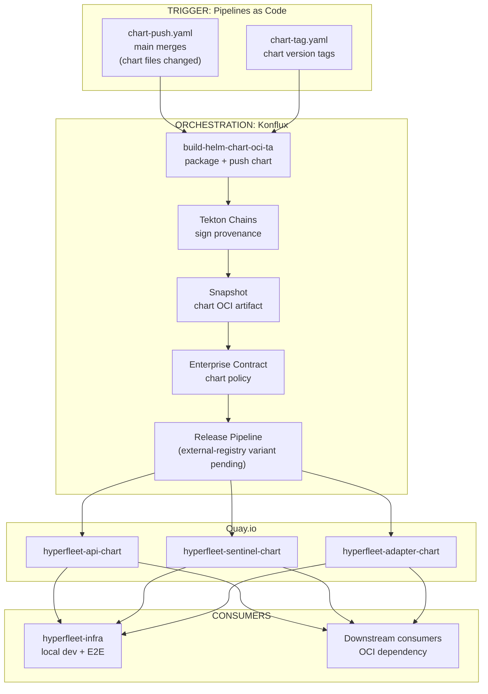

# Helm OCI Distribution via Konflux

> **Audience:** HyperFleet developers, release owners, and partner teams consuming HyperFleet Helm charts.

- **JIRA Spike:** [HYPERFLEET-897](https://redhat.atlassian.net/browse/HYPERFLEET-897)
- **Parent Epic:** [HYPERFLEET-830](https://redhat.atlassian.net/browse/HYPERFLEET-830) (HyperFleet Components Konflux Onboarding)
- **ADR:** [0016 — Helm OCI Distribution](../../adrs/0016-helm-oci-distribution.md)
- **Related:** [Konflux Release Pipeline Design](./konflux-release-pipeline-design.md) (container image pipeline)

---

## 1. Overview

HyperFleet publishes Helm charts as OCI artifacts to Quay.io via the Konflux release pipeline, replacing the current `helm-git` plugin-based distribution. Charts are built, signed, and released through the same Konflux infrastructure used for container images.

**Key decisions:**

- Konflux native `build-helm-chart-oci-ta` task for chart packaging — no custom Tekton tasks or GitHub Actions
- Separate Konflux Components for chart builds (independent from container image Components)
- Managed release pipeline for chart OCI artifacts with chart-specific EC policy (external-registry variant to be requested from Konflux team)
- Charts published to `quay.io/redhat-services-prod/hyperfleet-tenant/` (flat namespace, `-chart` suffix)
- Chart image defaults point to Konflux-built images, overridable via `image.repository` and `image.tag` values
- `hyperfleet-infra` umbrella chart dependencies migrate from `helm-git` to `oci://` references

---

## 2. Background

### Current State (helm-git)

HyperFleet Helm charts are consumed via the `helm-git` plugin, pulling directly from Git repositories:

```
git+https://github.com/openshift-hyperfleet/hyperfleet-api@charts?ref=main
```

This requires every consumer to install the `helm-git` plugin. Git references are mutable, there is no content-addressable storage, no signing, and no provenance.

### Target State (OCI on Quay.io)

```
oci://quay.io/redhat-services-prod/hyperfleet-tenant/hyperfleet-api-chart:1.5.0
```

Native Helm CLI and ArgoCD support. No plugins. Immutable versions with SHA256 digests. Tekton Chains provenance. Enterprise Contract policy validation. Same registry and auth as container images.

### Industry Direction

The Helm ecosystem has converged on OCI as the standard distribution mechanism. Bitnami completed migration to OCI-only. Harbor removed ChartMuseum in v2.8. Azure retired legacy Helm repo endpoints. Helm 4 cements OCI as the primary distribution model.

---

## 3. Architecture

### Pipeline Flow



### What Lives Where

| Component | Location | Owner |
|-----------|----------|-------|
| Component chart source | Component repos (`hyperfleet-api/charts/`, etc.) | HyperFleet team |
| Deployment umbrella charts | [`hyperfleet-infra`](https://github.com/openshift-hyperfleet/hyperfleet-infra) repo (`helm/`) | HyperFleet team |
| Chart Konflux Components | `konflux-release-data` tenant config | HyperFleet team |
| Chart RPA + EC policy | `konflux-release-data` config | HyperFleet team |
| `build-helm-chart-oci-ta` task | Konflux build-definitions (maintained by Konflux) | Konflux platform team |
| Release pipeline | Konflux release-service-catalog (maintained by Konflux) | Konflux platform team |

---

## 4. Charts Published

### Component Charts

Individual charts for each service, published from their respective repos:

| Chart | Source | OCI Target |
|-------|--------|------------|
| `hyperfleet-api-chart` | `hyperfleet-api/charts/` | `quay.io/redhat-services-prod/hyperfleet-tenant/hyperfleet-api-chart` |
| `hyperfleet-sentinel-chart` | `hyperfleet-sentinel/charts/` | `quay.io/redhat-services-prod/hyperfleet-tenant/hyperfleet-sentinel-chart` |
| `hyperfleet-adapter-chart` | `hyperfleet-adapter/charts/` | `quay.io/redhat-services-prod/hyperfleet-tenant/hyperfleet-adapter-chart` |

### hyperfleet-infra (Not Published to OCI)

The [`hyperfleet-infra`](https://github.com/openshift-hyperfleet/hyperfleet-infra) repo contains per-deployment umbrella charts (`helm/api`, `helm/sentinel-clusters`, `helm/adapter1`, etc.) used for local development and E2E testing. These are not published to OCI. After migration, their dependency references switch from `helm-git` to OCI:

```yaml
# hyperfleet-infra/helm/api/Chart.yaml (before)
dependencies:
  - name: hyperfleet-api
    version: "1.0.0"
    repository: "git+https://github.com/openshift-hyperfleet/hyperfleet-api@charts?ref=main"

# hyperfleet-infra/helm/api/Chart.yaml (after)
dependencies:
  - name: hyperfleet-api-chart
    version: "~1.2.0"
    repository: "oci://quay.io/redhat-services-prod/hyperfleet-tenant"
```

---

## 5. Konflux Integration

### Separate Components for Charts

Each component repo registers TWO Konflux Components:

| Konflux Component | Build Task | Produces |
|-------------------|-----------|----------|
| `hyperfleet-api` (existing) | `docker-build-oci-ta` | Container image |
| `hyperfleet-api-chart` (new) | `build-helm-chart-oci-ta` | Helm chart OCI artifact (`hyperfleet-api-chart`) |

Both produce Snapshots that auto-release through their respective RPAs.

### build-helm-chart-oci-ta

The [`build-helm-chart-oci-ta`](https://github.com/konflux-ci/build-definitions/tree/main/task/build-helm-chart-oci-ta) task (v0.3):
- Packages the Helm chart and pushes to OCI registry
- Computes semver from git tags
- Outputs `IMAGE_URL` and `IMAGE_DIGEST` for Tekton Chains provenance

### Release Pipeline

> **Dependency:** No managed pipeline currently exists for pushing Helm charts to external registries (quay.io). The existing `rh-push-helm-chart-to-registry-redhat-io` targets `registry.redhat.io` only (product releases). A request needs to be filed with the Konflux release-service team for an external-registry variant (reference RELEASE-2363). This design assumes that pipeline will be available.

The expected pipeline would follow the same pattern as `rh-push-helm-chart-to-registry-redhat-io`:

1. Validate helm chart snapshot (`validate-helm-chart-snapshot`)
2. Enterprise Contract verification (chart-specific policy)
3. Push to target registry (quay.io)

### Enterprise Contract Policy

EC works for chart OCI artifacts with container-specific rules excluded:

| Rule | Included? | Reason |
|------|-----------|--------|
| Provenance verification | Yes | Chains-generated provenance is verified |
| Policy compliance | Yes | Standard policy validation |
| Base image registries | No | No base image concept for charts |
| CVE scanning | No | Not applicable to charts |
| Required labels | No | Container label requirements |
| SBOM | No | No SBOM generation for charts |

Policy is derived from `registry-standard` with these exclusions. RHOAI uses this pattern in production (`registry-rhoai-chart-prod` policy).

---

## 6. Versioning

### Coupled Version — Chart Tracks App

```yaml
# Chart.yaml
apiVersion: v2
name: hyperfleet-api-chart
version: 1.5.0          # Same as the git tag
appVersion: "1.5.0"     # Same as the git tag
```

Chart version and app version are always the same. When the component is tagged `v1.5.0`, the `build-helm-chart-oci-ta` task strips the `v` prefix and publishes as `hyperfleet-api-chart:1.5.0` with `appVersion: 1.5.0`. One version to track, one tag to reason about.

This works because:
- Chart and application source live in the same repo and are tagged together
- The `build-helm-chart-oci-ta` task derives the version from the git tag automatically
- Chart templates rarely change independently of the application code
- Independent versioning would add pipeline complexity (separate triggers, version matrix) with no practical benefit for our team size and chart complexity

---

## 7. Consuming Published Charts

```bash
# Pull
helm pull oci://quay.io/redhat-services-prod/hyperfleet-tenant/hyperfleet-api-chart --version 1.5.0

# Install
helm install hyperfleet-api oci://quay.io/redhat-services-prod/hyperfleet-tenant/hyperfleet-api-chart \
  --version 1.5.0 \
  -f values.yaml \
  -n hyperfleet-system
```

As a Helm dependency:

```yaml
dependencies:
  - name: hyperfleet-api-chart
    version: "~1.5.0"
    repository: "oci://quay.io/redhat-services-prod/hyperfleet-tenant"
```

---

## 8. Trade-offs

**Gains:**

- No plugin dependency for chart consumers — standard Helm CLI and ArgoCD OCI support
- Immutable, content-addressable chart versions with SHA256 digests
- Supply chain security — Tekton Chains provenance for charts
- Single registry (Quay.io) for all artifacts (images + charts)
- Single pipeline (Konflux) for build, sign, validate, release
- Chart image defaults point to Konflux-built images, overridable for local dev and E2E

**Trade-offs:**

- Additional Konflux Components to register and maintain (one per chart)
- Chart RPA + EC policy needed alongside existing container image RPA
- `hyperfleet-infra` umbrella chart dependency migration requires testing with local dev and E2E workflows

---

## 9. Alternatives Considered

| Alternative | Why Rejected |
|-------------|--------------|
| Continue with helm-git | Plugin dependency for every consumer. No versioning, signing, or provenance. ArgoCD requires custom images. Industry is moving away from it. |
| GitHub Actions for chart publishing | Creates a split pattern (Konflux for images, GHA for charts). No Chains provenance. Separate signing setup. Konflux has native support, so no reason to go outside it. |
| Traditional Helm repository (ChartMuseum / GitHub Pages) | Separate infrastructure from container images. No content-addressable storage. ChartMuseum is deprecated (Harbor removed it in v2.8). GitHub Pages creates a parallel system outside Red Hat ecosystem. |
| Single Konflux Component for image + chart | Konflux's Snapshot model produces one artifact (`IMAGE_URL` + `IMAGE_DIGEST`) per Component. A single Component cannot produce both a container image and a Helm chart OCI artifact. Confirmed by RHOAI and flightctl patterns — all teams use separate Components. |

---
