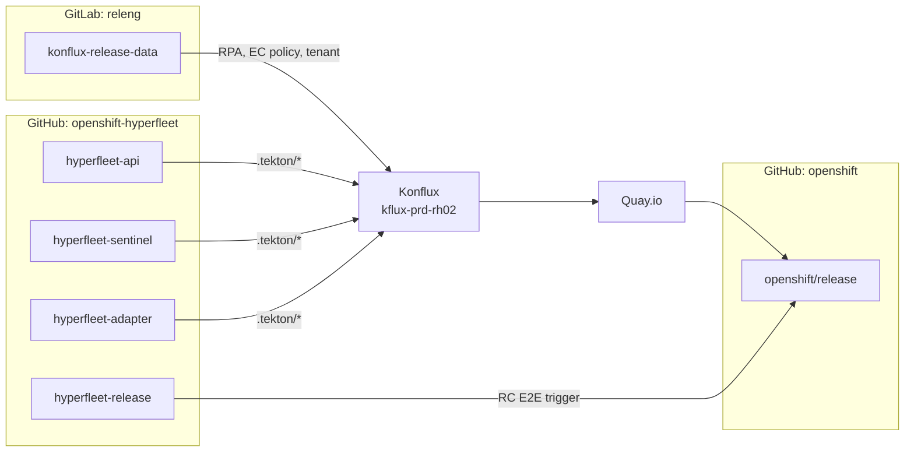

# Configuration Map

> **Audience:** HyperFleet engineers who need to find, read, or change a release-related config file. Tells you which repo holds what, what it does, and who reviews changes.

The HyperFleet Konflux setup is split across six repos. This page is the index. For the WHY behind the design, see [Konflux Release Pipeline Design](../konflux-release-pipeline-design.md) and [ADR 0014](../../../adrs/0014-konflux-build-and-release.md).

---

## At a glance

---

## `konflux-release-data` (GitLab)

URL: <https://gitlab.cee.redhat.com/releng/konflux-release-data>. This is the GitOps source of truth for everything the Konflux platform applies to our tenant. Changes go via MR; ArgoCD syncs them onto `kflux-prd-rh02`. CI runs `tox` — see the repo's `CLAUDE.md` for the lint/test matrix.

| File | Purpose |
|------|---------|
| `config/kflux-prd-rh02.0fk9.p1/service/ReleasePlanAdmission/hyperfleet/hyperfleet.yaml` | RPA for the three component images. Maps Snapshots to Quay paths, applies tags, references the Slack webhook secret. |
| `config/kflux-prd-rh02.0fk9.p1/service/ReleasePlanAdmission/hyperfleet/hyperfleet-charts.yaml` | RPA for Helm chart OCI releases. Uses `push-to-external-registry`; targets `…/hyperfleet-api-chart`. |
| `constraints/service/hyperfleet.yaml` | JSON-schema constraint that validates our RPAs (origin, policy, registry URL prefix, pipeline source, service account). |
| `config/kflux-prd-rh02.0fk9.p1/service/EnterpriseContractPolicy/registry-hyperfleet-chart-prod.yaml` | EC policy for chart releases. Derived from `app-interface-standard`; excludes container-only checks. |
| `tenants-config/cluster/kflux-prd-rh02/tenants/hyperfleet-tenant/` | Tenant namespace, RBAC, Application (`hyperfleet`), three Components, ReleasePlan. Source files only — never edit `auto-generated/`. |
| `CODEOWNERS` | Approval routing. HyperFleet paths require team approval. |

The container RPA uses policy `app-interface-standard`; the chart RPA uses `registry-hyperfleet-chart-prod`. Both auto-release (`block-releases: false`). Service account for releases is `release-app-interface-prod`.

---

## Component repos: `hyperfleet-api`, `hyperfleet-sentinel`, `hyperfleet-adapter`

Each repo has the same shape. Replace `<svc>` with `api`, `sentinel`, or `adapter`.

| File | Triggers on | Notes |
|------|-------------|-------|
| `.tekton/hyperfleet-<svc>-push.yaml` | Merge to `main` | Builds with `APP_VERSION=0.0.0-dev` default. Powers nightly. |
| `.tekton/hyperfleet-<svc>-tag.yaml` | Push of a semver tag (`vX.Y.Z` or `vX.Y.Z-rcN`) | CEL match in PaC annotation — see [Pipeline Anatomy](./pipeline-anatomy.md#what-triggers-what) for the exact pattern. `extract-version` task strips `refs/tags/v` → injects `APP_VERSION`. |
| `.tekton/hyperfleet-<svc>-chart-push.yaml` | Merge to `main` (chart path) | Builds and releases the component's Helm chart alongside the image, via the chart RPA. |
| `Dockerfile` | — | Contract: `ARG APP_VERSION="0.0.0-dev"` and `LABEL version="${APP_VERSION}"`. The label is what the RPA's `{{ labels.version }}` template reads. |

If you change the CEL regex or the Dockerfile `APP_VERSION` contract, you change the release flow. See [Pipeline Anatomy](./pipeline-anatomy.md) for the version chain.

---

## Helm chart artifacts

Each component repo ships its own Helm chart through its `.tekton/hyperfleet-<svc>-chart-push.yaml` pipeline, and the chart artifact is released alongside the image via the `hyperfleet-charts.yaml` RPA.

For the chart distribution design see [Helm OCI Distribution Design](../helm-oci-distribution-design.md) and [ADR 0016](../../../adrs/0016-helm-oci-distribution.md).

---

## `hyperfleet-release`

The release coordination repo. Holds the manifest that pins which component versions form a release candidate or GA.

| File | Purpose |
|------|---------|
| `RELEASE_MANIFEST.yaml` | Pinned component versions for the current release. Schema: `release`, `e2e_ref`, `components.{hyperfleet-api,hyperfleet-sentinel,hyperfleet-adapter}`. |
| `scripts/trigger-rc-e2e.sh` | Reads the manifest, verifies each image exists in Quay, calls Gangway to start the Prow RC E2E job. |
| `scripts/README.md` | Prerequisites and dry-run usage for the trigger script. |
| `RELEASE` | Top-level release status / notes (per-release). |

The manifest is the source of truth for *which combination of images is under test* — Konflux Snapshots are the build source of truth.

---

## `openshift/release` (Prow)

| Path | Purpose |
|------|---------|
| `ci-operator/config/openshift-hyperfleet/` | ci-operator configs per repo (PR presubmits, nightly E2E, RC E2E). |
| `ci-operator/jobs/openshift-hyperfleet/` | Generated Prow job YAML (regenerated from configs). |
| `ci-operator/step-registry/hyperfleet/` | Reusable Hyperfleet steps (commitlint, risk-scorer). |
| `ci-operator/step-registry/openshift-hyperfleet/chart-deployment/` | Chart deployment step for E2E. |

For how to add a new E2E job or modify the Gangway trigger flow, see [Add Hyperfleet E2E CI Job in Prow](../test-release/add-hyperfleet-e2e-ci-job-in-prow.md) and [Trigger HyperFleet E2E Jobs via Gangway API](../test-release/trigger-e2e-jobs-via-gangway.md).

---

## Konflux cluster

Things that exist on the cluster, not in a repo. The repos above declare them via GitOps.

| Resource | Location |
|----------|----------|
| Konflux UI | <https://konflux-ui.apps.kflux-prd-rh02.0fk9.p1.openshiftapps.com/> |
| Tenant namespace | `hyperfleet-tenant` on `kflux-prd-rh02` |
| Application | `hyperfleet` (single app, three Components) |
| Slack webhook secret | `hyperfleet-slack-webhook-notification-secret` (key `webhook-url`) in `rhtap-releng-tenant`. Created and rotated by RelEng. |
| Pyxis secret | Shared RelEng secret in `rhtap-releng-tenant`. |

---

## Who reviews what

| Area | Reviewer source |
|------|-----------------|
| `konflux-release-data` HyperFleet paths | `CODEOWNERS` in that repo — HyperFleet team |
| Component repo `.tekton/` and `Dockerfile` | Repo `CODEOWNERS` / `OWNERS` |
| `openshift/release` HyperFleet configs | `OWNERS` under `ci-operator/config/openshift-hyperfleet/` |
| Cluster-side resources (secrets in `rhtap-releng-tenant`) | RelEng — coordinate via `#forum-konflux-release` |

For escalation contacts and Slack channels see [Support](./support.md).
