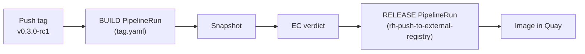

# Pipeline Anatomy: Reading a Release Build

> **Audience:** HyperFleet engineers staring at a Konflux PipelineRun for the first time. Tells you what each task does, how to find what you need in the UI, and the one trap that catches everyone.

For the architectural rationale (why two pipeline files per component, why CEL, why one Application), see [Konflux Release Pipeline Design](../konflux-release-pipeline-design.md). This page is operational: what runs, where to look, how to confirm.

---

## The one thing to remember

**The build PipelineRun is not the release.** They are two separate runs:



When the build run goes green, the image is *not in the target registry yet*. A second run — the Release — pushes it. People watch the build finish, run `skopeo`, see nothing, and panic. Give it another minute or two and look under the **Releases** tab in the Konflux UI.

---

## What triggers what

| Action | PaC matches | Build pipeline | `APP_VERSION` value |
|--------|-------------|----------------|---------------------|
| Merge to `main` | `.tekton/hyperfleet-<svc>-push.yaml` | docker-build-oci-ta | `0.0.0-dev` (Dockerfile default) |
| Push `vX.Y.Z` tag | `.tekton/hyperfleet-<svc>-tag.yaml` | docker-build-oci-ta | extracted from tag (e.g. `0.3.0`) |
| Push `vX.Y.Z-rcN` tag | same | same | e.g. `0.3.0-rc1` |
| Chart path on `main` | `.tekton/hyperfleet-<svc>-chart-push.yaml` | helm chart build | n/a |

CEL match for the tag pipeline (used in the PaC annotation):

```text
event == "push" && target_branch.matches("^refs/tags/v[0-9]+\\.[0-9]+\\.[0-9]+(-rc[0-9]+)?$")
```

The run name in the UI is `hyperfleet-<svc>-on-tag-<random>` (or `…-on-push-…`). Find it under **Applications → hyperfleet → Pipeline runs**.

---

## The build DAG

What the graph shows, left to right (from the `v0.3.0-rc1` reference run):

```text
init
 ├─ clone-repository ─┐
 └─ extract-version ──┤
                      ▼
            prefetch-dependencies
                      ▼
              build-container
                      ▼
             build-image-index
                      ▼
      ┌──────────────┴──────────── fan-out (parallel) ──────────────┐
      build-source-image            sast-snyk-check        apply-tags
      deprecated-base-image-check   clamav-scan            push-dockerfile
      clair-scan                    sast-shell-check        rpms-signature-scan
      sast-unicode-check            ecosystem-cert-preflight-checks
```

| Task | What it does | Blocking? |
|------|--------------|-----------|
| `extract-version` | Strips `refs/tags/v` → produces the version string (e.g. `v0.3.0-rc1` → `0.3.0-rc1`). Feeds `APP_VERSION`. HyperFleet-specific. | Blocking |
| `clone-repository` | Pulls source at the tagged commit. | Blocking |
| `prefetch-dependencies` | Cachi2 prefetch (hermetic support). Non-hermetic today. | Blocking |
| `build-container` | Buildah build, injects `APP_VERSION` build-arg. | Blocking |
| `build-image-index` | Manifest-list / image index. | Blocking |
| `apply-tags` | Build-time tags on the internal image. | Blocking |
| `build-source-image` | Source-container image. RPA's `pushSourceContainer: false` means the release doesn't push it. | Blocking on build |
| `clair-scan` | CVE scan. | Advisory (`app-interface-standard` excludes the gate) |
| `sast-snyk-check` | Snyk Code SAST. | Advisory |
| `clamav-scan` | Malware scan. | Advisory |
| `sast-shell-check`, `sast-unicode-check` | Additional SAST. | Advisory |
| `deprecated-base-image-check`, `rpms-signature-scan`, `ecosystem-cert-preflight-checks` | Supply-chain checks. | Mostly advisory |

Most scan tasks run on every build and surface findings without stopping the release. A failed advisory task is signal, not a stop-the-line event — investigate, but the release continues.

---

## How the version gets into the Quay tag

```text
git tag v0.3.0-rc1
  → extract-version:  VERSION = "${TAG_REF#refs/tags/v}" = 0.3.0-rc1
    → build-container: --build-arg APP_VERSION=0.3.0-rc1
      → Dockerfile: ARG APP_VERSION="0.0.0-dev"  (overridden)  →  LABEL version="0.3.0-rc1"
        → RPA tag template: {{ labels.version }} = 0.3.0-rc1
          → Quay tag: hyperfleet-api:0.3.0-rc1
```

The `v` prefix is intentionally stripped — git tag `v0.3.0-rc1`, Quay tag `0.3.0-rc1`. The Dockerfile default `0.0.0-dev` is what nightly main builds get, because push.yaml doesn't pass `APP_VERSION`.

---

## The release run

Once the build run's Snapshot passes Enterprise Contract, the Release Service auto-runs `rh-push-to-external-registry` (because `block-releases: false` on the RPA). Find it under the **Releases** or **Snapshots** tab.

It pushes to:

```text
quay.io/redhat-services-prod/hyperfleet-tenant/hyperfleet/hyperfleet-<svc>
```

with tags from the RPA's `defaults.tags` block:

- `{{ labels.version }}` — e.g. `0.3.0-rc1`
- `{{ labels.version }}-{{ timestamp }}` — uniqued
- `{{ git_sha }}` — commit pin
- `latest` — moves on every successful release

The release run also handles Pyxis registration and (when wired) Slack notification — see [Notifications](./notifications.md).

---

## Reading the UI: where to look

| You want to see... | Go to |
|--------------------|-------|
| Was the build triggered? | Applications → `hyperfleet` → **Pipeline runs** → `…-on-tag-…` or `…-on-push-…` |
| What version was extracted | the run → `extract-version` task → **Logs** |
| Why a scan failed | the run → the scan task → **Logs** (Snyk SARIF artifact under task results) |
| Whether the release fired | **Releases** or **Snapshots** tab → the auto-created Release |
| EC verdict | Snapshot details → Enterprise Contract result |
| The actual image | `skopeo list-tags` against the prod registry (below) |

---

## Confirming it landed

```bash
skopeo list-tags docker://quay.io/redhat-services-prod/hyperfleet-tenant/hyperfleet/hyperfleet-api \
  | jq -r '.Tags[]' | grep '^0.3.0-rc1$'
```

Inspect the label to confirm the version baked in correctly:

```bash
skopeo inspect docker://quay.io/redhat-services-prod/hyperfleet-tenant/hyperfleet/hyperfleet-api:0.3.0-rc1 \
  | jq -r '.Labels.version'
# → 0.3.0-rc1
```

If the build ran but `skopeo list-tags` shows nothing matching, the release run hasn't fired or failed. See [Debugging: build green but image not in Quay](./debugging.md#build-green-but-image-not-in-quay).

---

## Related

- [Configuration Map](./configuration-map.md) — where each file in the diagram lives
- [Debugging](./debugging.md) — what to do when any of this fails
- [Notifications](./notifications.md) — Slack/Pyxis behavior on success/failure
- [Release Runbook](./release-runbook.md) — copy-paste release commands
