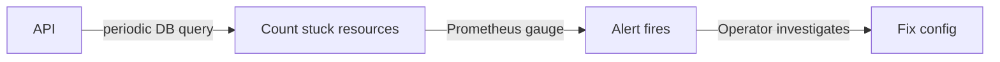

# Sentinel Sharding Coverage Design

> **Ticket:** [HYPERFLEET-1248](https://redhat.atlassian.net/browse/HYPERFLEET-1248)

## Table of Contents

- [Problem](#problem)
- [How](#how)
  - [API Stale-Resource Metric](#api-stale-resource-metric)
- [Possible Future Enhancements](#possible-future-enhancements)
- [Trade-offs](#trade-offs)
  - [What We Gain](#what-we-gain)
  - [What We Lose / What Gets Harder](#what-we-lose--what-gets-harder)
  - [Acceptable Because](#acceptable-because)
- [Alternatives Considered](#alternatives-considered)
  - [Catchall Sentinel](#catchall-sentinel)
  - [API-Side Sharding](#api-side-sharding)
  - [Consistent Hashing](#consistent-hashing)
  - [Cron Job Coverage Checker](#cron-job-coverage-checker)
  - [API Label Validation at Creation](#api-label-validation-at-creation)
  - [Document and Accept](#document-and-accept)
- [Additional Resources](#additional-resources)

---

## Problem

Sentinel supports horizontal scaling by deploying multiple instances with different `resource_selector` labels. Each instance polls the API with a server-side filter (e.g. `search=labels.region='us-east'`) and only sees resources matching its selector.

Instances are independent and stateless. They do not coordinate or know about each other. If a resource is created with labels that do not match any deployed instance's selector, no sharded sentinel will poll or evaluate that resource. No metric, alert, or log indicates the gap.

## How

### API Stale-Resource Metric

Add a background process to the API that periodically counts resources stuck in a not-reconciled state beyond a configurable threshold. The count is exposed as a Prometheus gauge. An alert rule fires when the count is above zero, notifying operators to investigate.

The API already has access to all resources and their reconciliation state, so no new components are needed.

This does not identify the cause (could be a sharding gap, a broken adapter, or a dead broker). The operator investigates by querying the API for stuck resources and comparing their labels against deployed sentinels.

## Possible Future Enhancements

- Labels endpoint: a dedicated API endpoint (e.g. `GET /clusters/labels`) that returns all distinct label keys and values across resources. Would give operators a quick overview of what labels exist without listing every cluster.

## Trade-offs

### What We Gain

- Surfaces stuck resources that would otherwise go unnoticed indefinitely
- No new components to deploy or maintain (runs inside existing API process)
- No coupling to sentinel's config or deployment model
- Catches more than just sharding gaps (also detects broken adapters, dead brokers, or any other reason a resource stays unreconciled)
- Operators already have a way to investigate (existing `search` parameter on list endpoints)

### What We Lose / What Gets Harder

- Does not pinpoint the cause. The metric says "something is stuck," not "this is a sharding gap." Operators must investigate manually.
- Adds a periodic database query to the API. An existing BTREE index on the Reconciled condition (`idx_clusters_reconciled_status`) supports this query, so it should be lightweight.
- If multiple API replicas are running, each replica runs the same check independently. This is harmless at small scale but could be addressed with a configurable interval or leader election if needed.
- Threshold tuning: too short triggers false positives (normal reconciliation in progress), too long delays detection.

### Acceptable Because

- The sharding contract (operator responsibility) does not change
- The background process is a scoped deviation from the API's "pure data layer" constraint: it is read-only, has no side effects beyond metric emission, and does not introduce coupling to sentinel or any other component
- Operators can investigate using existing API search (e.g. `search=status.conditions.Reconciled='False'`), though this requires manual cross-referencing against deployed sentinel configs
- The DB query is a `COUNT(*)` using an existing BTREE index on the Reconciled condition, comparable to existing API list queries
- Detects all stuck resources (not just sharding gaps), at the cost of less precise root-cause information

## Alternatives Considered

### Catchall Sentinel

**What**: Deploy a sentinel with an empty `resource_selector` that watches all resources. Already works with no code changes.

**Why Rejected**: Sentinel has one mode: poll, evaluate, publish. A catchall would evaluate all resources and publish duplicate events for any resource that a sharded sentinel also covers. Making it detect-only would require a new mode and knowledge of what other sentinels cover, reintroducing the coordination problem the stateless design avoids.

### API-Side Sharding

**What**: The API assigns resources to sentinels at creation time.

**Why Rejected**: Couples the API to sentinel's deployment topology. The API is a pure CRUD data layer with no awareness of sentinel. This would require the API to know which sentinels are deployed and their selectors, breaking the one-way dependency (sentinel knows about the API, not the reverse).

### Consistent Hashing

**What**: Sentinel determines which resources to handle via hashing instead of operator-configured label selectors.

**Why Rejected**: Changes the sharding contract from label-based filtering to an automated hashing model. This is a fundamental architectural change, not a detection/surfacing solution.

### Cron Job Coverage Checker

**What**: A Kubernetes CronJob that queries the API for all resources and Kubernetes for deployed sentinel ConfigMaps, then compares labels against selectors to find uncovered resources.

**Why Rejected**: Requires a new component to build, deploy, and maintain. Needs Kubernetes API access and RBAC to read sentinel ConfigMaps. Coupled to sentinel's config format. The API metric catches the same stuck resources without any dependency on sentinel.

### API Label Validation at Creation

**What**: Reject cluster creation if the labels don't match any known sentinel selector. Prevents orphaned resources at the source.

**Why Rejected**: Couples the API to sentinel's deployment topology. The API would need to know which sentinels are deployed and their selectors, breaking the one-way dependency.

### Document and Accept

**What**: Keep the current behavior and rely on existing documentation that describes sharding coverage as an operator responsibility.

**Why Rejected**: Documentation alone does not proactively notify operators when a gap occurs. Resources can sit unreconciled indefinitely without anyone being aware.

## Additional Resources

- [Sentinel: Multi-Instance Deployment](https://github.com/openshift-hyperfleet/hyperfleet-sentinel/blob/main/docs/multi-instance-deployment.md)
- [Sentinel: Operator Guide](https://github.com/openshift-hyperfleet/hyperfleet-sentinel/blob/main/docs/sentinel-operator-guide.md)
- [Architecture: Sentinel Design](../components/sentinel/sentinel.md)
