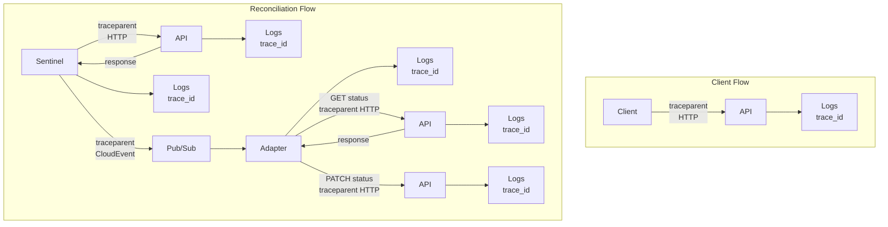

# HyperFleet Tracing and Telemetry Standard

This document defines the standard approach for distributed tracing across all HyperFleet components (API, Sentinel, Adapters).

---

## Overview

### Goals

- **Visibility**: End-to-end request tracing across API, Sentinel, and Adapters
- **Correlation**: Link traces with logs and metrics for unified observability
- **Consistency**: All components instrument tracing the same way
- **Debuggability**: Enable efficient troubleshooting of distributed operations

### Non-Goals

- Observability infrastructure setup (backend, storage, visualization)
- Retroactive instrumentation of existing code (separate tickets)
- Creating a shared tracing library

---

## OpenTelemetry Adoption

HyperFleet adopts [OpenTelemetry](https://opentelemetry.io/) as the standard for distributed tracing.

### Why OpenTelemetry

- **Vendor-neutral**: Works with any observability backend (Jaeger, Tempo, Cloud Trace, etc.)
- **Industry standard**: CNCF project with broad adoption
- **Unified API**: Single API for traces, metrics, and logs
- **Auto-instrumentation**: Libraries available for common frameworks
- **W3C Trace Context**: Native support for standard trace propagation

### SDK Requirements

All HyperFleet components MUST use the OpenTelemetry Go SDK:

```go
import (
    "go.opentelemetry.io/otel"
    "go.opentelemetry.io/otel/sdk/trace"
    "go.opentelemetry.io/otel/exporters/otlp/otlptrace/otlptracegrpc"
)
```

---

## Configuration

All components MUST support tracing configuration via **environment variables**. Command-line flags are optional.

| Environment Variable | Default | Description |
|---------------------|---------|-------------|
| `OTEL_SERVICE_NAME` | Component name | Service name for traces |
| `OTEL_EXPORTER_OTLP_ENDPOINT` | `localhost:4317` | OTLP gRPC endpoint |
| `OTEL_EXPORTER_OTLP_PROTOCOL` | `grpc` | Protocol: `grpc` or `http/protobuf` |
| `OTEL_TRACES_SAMPLER` | `parentbased_traceidratio` | Sampler type |
| `OTEL_TRACES_SAMPLER_ARG` | `1.0` | Sampler argument (ratio for ratio-based samplers) |
| `OTEL_PROPAGATORS` | `tracecontext,baggage` | Context propagators |
| `OTEL_RESOURCE_ATTRIBUTES` | - | Additional resource attributes |
| `TRACING_ENABLED` | `true` | Enable/disable tracing |

### Service Names

Each component MUST set `OTEL_SERVICE_NAME` to its component name:

| Component | Service Name |
|-----------|--------------|
| API | `hyperfleet-api` |
| Sentinel | `hyperfleet-sentinel` |
| Validation Adapter | `hyperfleet-adapter-validation` |
| Provisioning Adapter | `hyperfleet-adapter-provisioning` |

### Resource Attributes

Components SHOULD include the following resource attributes via `OTEL_RESOURCE_ATTRIBUTES`:

| Attribute | Source | Description |
|-----------|--------|-------------|
| `service.version` | Build process | Service version from git SHA (e.g., `a1b2c3d`) |
| `k8s.namespace.name` | Helm/Downward API | Kubernetes namespace for environment isolation |

> **Note:** The `k8s.namespace.name` attribute serves as the environment differentiator. Different namespaces (e.g., `hyperfleet-prod`, `hyperfleet-stage`, `hyperfleet-dev-rafael`) naturally isolate traces in multi-tenant deployments. The `deployment.environment` attribute is optional and can be omitted when namespace-based isolation is sufficient.

#### Setting service.version from Build

Use the git SHA as the version during build (as already done in hyperfleet-api):

```makefile
build_version := $(shell git rev-parse --short HEAD)$(shell git diff --quiet || echo '-dirty')
ldflags := -X main.Version=$(build_version)
```

Then set the resource attribute at runtime:

```yaml
env:
  - name: OTEL_RESOURCE_ATTRIBUTES
    value: "service.version=$(VERSION),k8s.namespace.name=$(NAMESPACE)"
```

#### Example Configuration

```bash
OTEL_RESOURCE_ATTRIBUTES="service.version=a1b2c3d,k8s.namespace.name=hyperfleet-stage"
```

---

## Trace Context Propagation

HyperFleet uses [W3C Trace Context](https://www.w3.org/TR/trace-context/) for trace propagation across service boundaries.

### HTTP Requests

Extract and inject trace context from/to HTTP headers:

```go
import (
    "go.opentelemetry.io/otel"
    "go.opentelemetry.io/otel/propagation"
)

// Server: Extract context from incoming request
ctx := otel.GetTextMapPropagator().Extract(r.Context(), propagation.HeaderCarrier(r.Header))

// Client: Inject context into outgoing request
otel.GetTextMapPropagator().Inject(ctx, propagation.HeaderCarrier(req.Header))
```

### CloudEvents (Pub/Sub)

Trace context MUST be propagated via CloudEvents extension attributes:

| Extension | Description |
|-----------|-------------|
| `traceparent` | W3C Trace Context traceparent header |
| `tracestate` | W3C Trace Context tracestate header (optional) |

```go
// Publisher: Add trace context to CloudEvent
event := cloudevents.NewEvent()
event.SetExtension("traceparent", traceparentFromContext(ctx))

// Subscriber: Extract trace context from CloudEvent
traceparent, _ := event.Extensions()["traceparent"].(string)
ctx := contextFromTraceparent(ctx, traceparent)
```

### Propagation Flow

HyperFleet has two main trace flows:

1. **Reconciliation**: Sentinel → API → Sentinel → Pub/Sub → Adapter (asynchronous)
2. **Client requests**: Client → API (synchronous HTTP)



> **Note:** Sentinel initiates traces during polling cycles. The trace context propagates through CloudEvents to Adapters, which include it when updating status back to the API.

---

## Required Spans

Components MUST create spans for the following operations.

### Span Naming Convention

Follow [OpenTelemetry Semantic Conventions](https://opentelemetry.io/docs/specs/semconv/) for span names:

| Span Type | Naming Pattern | Example |
|-----------|----------------|---------|
| HTTP Server | `{method} {route}` | `GET /clusters/{id}` |
| HTTP Client | `{method}` | `GET` |
| Database | `{operation} {table}` | `SELECT clusters` |
| Messaging | `{destination} {operation}` | `hyperfleet-clusters publish` |
| Custom | `{component}.{operation}` | `sentinel.evaluate` |

> **Note:** Use attributes (not span names) for high-cardinality values like IDs, hostnames, or dynamic paths.

### All Components

| Operation | Span Name | Required |
|-----------|-----------|----------|
| HTTP request handling | `{method} {route}` | When exposing HTTP |
| External HTTP calls | `{method}` | When making HTTP calls |
| Database operations | `{operation} {table}` | When using database |

### API

| Operation | Span Name Pattern | Example |
|-----------|-------------------|---------|
| Request handling | `{method} {route}` | `GET /clusters/{id}` |
| Database query | `{operation} {table}` | `SELECT clusters` |
| Authentication | `api.{operation}` | `api.validate_token` |

### Sentinel

| Operation | Span Name Pattern | Example |
|-----------|-------------------|---------|
| Poll cycle | `sentinel.{operation}` | `sentinel.poll` |
| Decision evaluation | `sentinel.{operation}` | `sentinel.evaluate` |
| Event publish | `{destination} {operation}` | `hyperfleet-clusters publish` |
| API call | `{method}` | `GET` |

> **Note:** HTTP client span names use only the method per [OpenTelemetry semantic conventions](https://opentelemetry.io/docs/specs/semconv/http/http-spans/#http-client). To differentiate calls to different APIs, use the `server.address` and `url.path` attributes (see [HTTP Spans](#http-spans) below).

### Adapters

| Operation | Span Name Pattern | Example |
|-----------|-------------------|---------|
| Event receive | `{destination} {operation}` | `hyperfleet-clusters receive` |
| Event process | `adapter.{operation}` | `adapter.process` |
| Cloud provider call | `{method}` | `POST` |
| Status update | `{method}` | `PATCH` |

> **Note:** For cloud provider calls, use the `cloud.provider`, `cloud.service`, and `server.address` attributes to identify which service is being called (see [Cloud Provider Spans](#cloud-provider-spans) below).

---

## Standard Span Attributes

### Semantic Conventions

Follow [OpenTelemetry Semantic Conventions](https://opentelemetry.io/docs/specs/semconv/) for common attributes.

### HTTP Spans

| Attribute | Type | Description |
|-----------|------|-------------|
| `http.request.method` | string | HTTP method |
| `url.path` | string | Request path (sanitized) |
| `http.response.status_code` | int | Response status code |
| `server.address` | string | Server hostname |
| `http.route` | string | Route template (e.g., `/clusters/{id}`) |

### Database Spans

| Attribute | Type | Description |
|-----------|------|-------------|
| `db.system` | string | Database type (`postgresql`, `redis`) |
| `db.operation.name` | string | Operation (`SELECT`, `INSERT`, etc.) |
| `db.collection.name` | string | Table/collection name |

### Messaging Spans (Pub/Sub)

| Attribute | Type | Description |
|-----------|------|-------------|
| `messaging.system` | string | Messaging system (`gcp_pubsub`) |
| `messaging.operation.type` | string | Operation (`publish`, `receive`, `process`) |
| `messaging.destination.name` | string | Topic or subscription name |
| `messaging.message.id` | string | Message ID |

### Cloud Provider Spans

| Attribute | Type | Description |
|-----------|------|-------------|
| `cloud.provider` | string | Cloud provider (`gcp`, `aws`, `azure`) |
| `cloud.service` | string | Cloud service name (`gke`, `storage`, `pubsub`) |
| `server.address` | string | API endpoint hostname |
| `cloud.resource_id` | string | Resource identifier (e.g., cluster name, bucket name) |

Example for a GKE API call:

```go
span.SetAttributes(
    attribute.String("cloud.provider", "gcp"),
    attribute.String("cloud.service", "gke"),
    attribute.String("server.address", "container.googleapis.com"),
    attribute.String("cloud.resource_id", "projects/my-project/locations/us-central1/clusters/my-cluster"),
)
```

### HyperFleet-Specific Attributes

| Attribute | Type | Description |
|-----------|------|-------------|
| `hyperfleet.cluster_id` | string | Cluster identifier |
| `hyperfleet.resource_type` | string | Resource type (`clusters`, `nodepools`) |
| `hyperfleet.resource_id` | string | Resource identifier |
| `hyperfleet.adapter` | string | Adapter type name |
| `hyperfleet.decision_reason` | string | Sentinel decision reason |

### Attribute Best Practices

**DO:**
- Use semantic conventions where applicable
- Include resource identifiers for debugging
- Sanitize paths to avoid high cardinality

**DON'T:**
- Include sensitive data (tokens, passwords, PII)
- Use high-cardinality values as span names
- Include large payloads in attributes

---

## Sampling Strategy

### Head-Based vs Tail-Based Sampling

| Approach | Decision Point | Pros | Cons |
|----------|---------------|------|------|
| **Head-based** | At trace start | Simple, low overhead, no data buffering | Cannot sample based on outcome (errors, latency) |
| **Tail-based** | After trace completes | Can sample interesting traces (errors, slow) | Requires buffering, higher resource usage |

**HyperFleet uses head-based sampling** for simplicity and lower operational overhead. Tail-based sampling requires additional infrastructure (OpenTelemetry Collector with tail sampling processor) and is recommended only when error/latency-based sampling is critical.

### Default: Parent-Based Trace ID Ratio

HyperFleet uses `parentbased_traceidratio` as the default sampler.

**Why this sampler:**

1. **Recommended by OpenTelemetry** - This is the default production sampler suggested by OTel SDKs and Collector documentation
2. **Trace completeness** - Parent-based sampling ensures all spans in a trace are either sampled or not, avoiding broken/incomplete traces
3. **Distributed consistency** - When Sentinel starts a trace and it propagates to Adapters via Pub/Sub, all downstream services respect the original sampling decision
4. **Predictable costs** - The ratio-based approach provides consistent sampling rates for capacity planning

**How it works:**

- If parent span exists: Follow parent's sampling decision (preserves trace completeness)
- If no parent (root span): Sample based on trace ID ratio

### Environment-Specific Sampling Rates

| Environment | Sampling Rate | Rationale |
|-------------|---------------|-----------|
| Development | `1.0` (100%) | Full visibility for debugging |
| Staging | `0.1` (10%) | Balance between visibility and cost |
| Production | `0.01` (1%) | Cost-effective for high-traffic systems |

### Configuration Example

```bash
# Development
OTEL_TRACES_SAMPLER=always_on

# Production
OTEL_TRACES_SAMPLER=parentbased_traceidratio
OTEL_TRACES_SAMPLER_ARG=0.01
```

### Always Sample Specific Operations

With head-based sampling, you can force 100% sampling for **known operations** at trace start:

- Specific API routes (e.g., `/admin/*`, `/debug/*`)
- Specific resource types (e.g., critical clusters)
- Requests with debug headers

This is achieved using a custom sampler that checks request attributes before the operation executes.

> **Limitation:** Head-based sampling cannot sample based on **outcomes** (errors, latency) because the decision is made before the operation completes. To capture all errors or slow requests, tail-based sampling with an OpenTelemetry Collector would be required. This is a future enhancement if needed.

---

## Exporter Configuration

### OTLP Exporter (Default)

All components MUST support OTLP as the primary export format:

```go
exporter, err := otlptracegrpc.New(ctx,
    otlptracegrpc.WithEndpoint(os.Getenv("OTEL_EXPORTER_OTLP_ENDPOINT")),
    otlptracegrpc.WithInsecure(), // For local development
)
```

### Kubernetes Deployment

In Kubernetes, configure the OTLP endpoint to point to an OpenTelemetry Collector:

```yaml
env:
  - name: OTEL_EXPORTER_OTLP_ENDPOINT
    value: "otel-collector.observability.svc:4317"
  - name: OTEL_SERVICE_NAME
    value: "hyperfleet-sentinel"
  - name: OTEL_TRACES_SAMPLER
    value: "parentbased_traceidratio"
  - name: OTEL_TRACES_SAMPLER_ARG
    value: "0.01"
```

### Local Development

For local development, use a local collector or stdout exporter:

```bash
# Use stdout for debugging
OTEL_TRACES_EXPORTER=console

# Or use a local Jaeger instance
OTEL_EXPORTER_OTLP_ENDPOINT=localhost:4317
```

---

## Integration with Logging

Traces MUST be correlated with logs via `trace_id` and `span_id` fields.

### Adding Trace Context to Logs

```go
import (
    "log/slog"
    "go.opentelemetry.io/otel/trace"
)

func logWithTrace(ctx context.Context, logger *slog.Logger, msg string, args ...any) {
    spanCtx := trace.SpanContextFromContext(ctx)
    if spanCtx.HasTraceID() {
        args = append(args,
            "trace_id", spanCtx.TraceID().String(),
            "span_id", spanCtx.SpanID().String(),
        )
    }
    logger.InfoContext(ctx, msg, args...)
}
```

### Log Output Example

```json
{
  "timestamp": "2025-01-15T10:30:00.123Z",
  "level": "info",
  "message": "Processing cluster event",
  "component": "adapter-validation",
  "trace_id": "4bf92f3577b34da6a3ce929d0e0e4736",
  "span_id": "00f067aa0ba902b7",
  "cluster_id": "cls-123"
}
```

For detailed logging requirements, see the [Logging Specification](./logging-specification.md).

---

## Error Handling in Spans

### Recording Errors

When an error occurs, record it on the span:

```go
import (
    "go.opentelemetry.io/otel/codes"
)

span.RecordError(err)
span.SetStatus(codes.Error, err.Error())
```

### Error Attributes

Include relevant context when recording errors:

```go
span.RecordError(err,
    trace.WithAttributes(
        attribute.String("error.type", "validation_error"),
        attribute.String("cluster_id", clusterID),
    ),
)
```

---

## Span Lifecycle Best Practices

### Starting and Ending Spans

```go
ctx, span := tracer.Start(ctx, "operation.name",
    trace.WithSpanKind(trace.SpanKindServer),
)
defer span.End()

// Do work...

if err != nil {
    span.RecordError(err)
    span.SetStatus(codes.Error, "operation failed")
    return err
}

span.SetStatus(codes.Ok, "")
```

### Context Propagation

Always pass context through the call chain:

```go
// Good: Context is propagated
func ProcessEvent(ctx context.Context, event Event) error {
    ctx, span := tracer.Start(ctx, "adapter.process")
    defer span.End()

    return updateStatus(ctx, event.ClusterID)
}

// Bad: Context is not propagated, trace is broken
func ProcessEvent(ctx context.Context, event Event) error {
    _, span := tracer.Start(ctx, "adapter.process")
    defer span.End()

    return updateStatus(context.Background(), event.ClusterID) // Trace broken!
}
```

---

## References

- [OpenTelemetry Go SDK](https://github.com/open-telemetry/opentelemetry-go)
- [OpenTelemetry Semantic Conventions](https://opentelemetry.io/docs/specs/semconv/)
- [W3C Trace Context](https://www.w3.org/TR/trace-context/)
- [OpenTelemetry Environment Variables](https://opentelemetry.io/docs/specs/otel/configuration/sdk-environment-variables/)
- [HyperFleet Logging Specification](./logging-specification.md)
- [HyperFleet Metrics Standard](./metrics.md)
